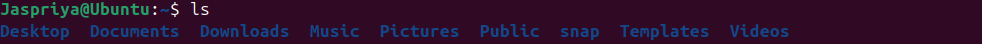

**The daily dairy**
# Day 01 :-
## Introduction
**What is Linux?**

Linux is a family of open-source operating systems , initially released by Linus Torvalds in 1991. It is an operating system, like Windows or macOS.It helps your computer run programs and talk to hardware (like your keyboard, screen, and internet).

**Why Learn Linux?**

1. Open Source and Free
2. Ideal for Developers 
3. Improves System Understanding
4. Better Security & Privacy
5. In-Demand Skill
6. It’s Everywhere

**Linux Distribution**

A Linux distribution is a complete Linux system made for different users. Ubuntu is one of the easiest and most popular distros for beginners who want to try Linux.

**What is Ubuntu?**
Ubuntu is one of the most popular Linux distributions. 
It's known for being:
- Beginner-friendly
- Free and open-source
- Regularly updated

**Difference between Linux and Windows**
 Feature             | Linux                                         | Windows                                      |
|--------------------|-----------------------------------------------|----------------------------------------------|
| **Type**           | Open-source operating system kernel + distros | Proprietary operating system by Microsoft    |
| **Cost**           | Mostly free to use                            | Usually paid license                         |
| **Source Code**    | Open source (anyone can view and modify)      | Closed source (proprietary)                  |
| **Security**       | Generally considered more secure              | Frequent target for malware, but improving   |
| **Software**       | Thousands of free and open-source apps        | Huge variety of commercial software          |
| **Installation**   | Various methods, often more technical         | Usually simple, guided installers            |

**Why Linux is better than Windows?**

Linux is better than Windows because it’s free, more secure, and highly customizable. It runs well on older hardware and offers strong support for developers. Plus, it respects your privacy.

## Installation of Linux

**Step 1: Download and Install VirtualBox**

VirtualBox is free software that lets you run virtual machines on your computer.

- Visit the official website: [https://www.virtualbox.org/](https://www.virtualbox.org/)
- Download the version for your operating system (Windows/macOS/Linux).
- Run the installer and follow the prompts to install VirtualBox.

**Step 2: Download Microsoft Visual C++ Redistributable**

Some applications need this to run properly on Windows.

- Go to the official Microsoft page: [https://learn.microsoft.com/en-US/cpp/windows/latest-supported-vc-redist](https://learn.microsoft.com/en-US/cpp/windows/latest-supported-vc-redist)
- Download the latest **x64** versions based on your system.
- Run the installers and follow instructions.

**Step 3: Download Ubuntu ISO**

Ubuntu is a popular Linux distribution.

- Go to [https://ubuntu.com/download/desktop](https://ubuntu.com/download/desktop)
- Download the latest Ubuntu Desktop ISO file.

**Step 4: Create a Virtual Machine and Install Ubuntu**

1. Open VirtualBox.
2. Click **New** to create a new virtual machine.
3. Name it “Ubuntu” and choose **Linux** as the type and **Ubuntu (64-bit)** as the version.
4. Assign memory (RAM).
5. Create a virtual hard disk.
6. After creating the VM, select it and click **Start**.
7. When prompted, browse to the downloaded Ubuntu ISO file.
8. Follow the on-screen instructions to install Ubuntu inside the VM.

---

**Step 5: Enjoy Ubuntu!**

Once installation finishes, you can start using Ubuntu inside VirtualBox.

## Study of some more concepts
**Difference between Product based , Service based companies and Startup**

| Feature                 | Product-based Companies                     | Service-based Companies                     | Startup                                                            |
|-------------------------|---------------------------------------------|---------------------------------------------|--------------------------------------------------------------------|
| **Definition**          | Build and sell their own products           | Provide services to clients/customers       | A new company aiming to solve a big problem in an innovative way   |
| **Revenue Model**       | Earn money by selling products              | Earn money by charging for services rendered| Usually a mix: early investment → selling product/service to scale |
| **Examples**            | Microsoft, Google, Apple                    | TCS, Infosys                                | Airbnb (home-booking), SpaceX (rockets), Stripe (digital payments) |
| **Focus**               | Product development and innovation          | Client satisfaction and project delivery    | Rapid growth, experimentation, market fit, scaling fast            |
| **Work Culture**        | Product lifecycle, feature updates          | Client deadlines, customization             | Fast decision-making,lean team                                     |

## Booting and its type
**What is Booting?**

Booting is the process of starting a computer. It loads the operating system (like Windows, Linux, or macOS) so the computer is ready to use.

 
 **Types of Booting** 
 
- **Cold Boot (Hard Boot):**

When you turn on a computer from a completely powered-off state.
Example: Pressing the power button to start your PC.

- **Warm Boot (Soft Boot):**

When you restart the computer without turning off the power.
Example: Clicking "Restart" or pressing Ctrl + Alt + Del.

# Day 02 
## Kernel

**What is a Kernel?**

The kernel is the core part of an operating system. It acts like a bridge between hardware and software.

**What the Kernel Does:**

Talks to the hardware (CPU, memory, devices)
Manages system resources (like files, memory, and processes)
Helps apps and the OS work together smoothly

## Introduction to Shell and Bash

**What is a Shell?**

A Shell is a program that lets you interact with your computer by typing commands. Shell acts as an interface between the user and the operating system software, allowing users to execute commands.

**Types of Shells**

*Bash* — The Workhorse: 

The most popular shell out there. It’s the everyday hero of Linux and macOS users.

*Sh* — The Classic: 

The original shell that’s simple, reliable, and works almost everywhere. Perfect if you like things straightforward and old-school.

*zsh* — The Customizer: 

Like bash, but with extra flair! It supports themes, plugins, and fancy auto-completion to make your terminal both powerful and stylish.

*fish* — The Friendly: 

Designed to be super user-friendly with colors, autosuggestions, and helpful hints right out of the box — ideal for beginners and pros who want to save time.

**Categories of Shells**

*Command Line Shells*

Let you type commands to control your computer.
Examples: bash, sh, zsh, fish.

*Graphical Shells*

Provide a visual interface with windows, icons, and menus.
Examples: Windows Explorer, macOS Finder.

## File System Structure

A file system structure is the way an operating system organizes, stores, and manages files on a storage device (like a hard drive, SSD, or USB). It defines how data is named, stored, and retrieved.

- / — Root directory (the starting point of the file system)

- /bin — Essential user binaries (programs)

- /boot — Files needed to boot the system (like the kernel)

- /dev — Device files representing hardware

- /etc — System-wide configuration files

- /home — Users’ personal directories (e.g., /home/alice)

- /lib — Essential shared libraries for programs

- /media — Mount points for removable media (USB, CDs)

- /mnt — Temporary mount points for filesystems

- /opt — Optional add-on software packages

- /srv — It is used to store data for services that run on the system.

- /root — Home directory of the root user (superuser)

- /sbin — System binaries (programs for admin tasks)

- /tmp — Temporary files

- /usr — User programs and data (many subdirectories)

- /var — Variable files like logs, mail, and caches

## Basic Shell Command (Linux)

- **ls**

List files and folders in the current directory

Syntax:-ls

  

- **whoami**
  
The whoami command shows the username of the current user logged into the shell.

Syntax:-whoami

- **date**

The date command in Linux is used to display the current date and time.
 
Syntax:-date

- **cd**
  
Change directory (e.g., cd Documents)
 
Syntax:- cd [directory_path]

- **mkdir**

Create a new directory,if already exist,error is displayed

Syntax:-mkdir [folder_name]

- **cat**

Creates the content of a file.

Syntax:-cat file.txt

- **touch**

Creates an empty file.

Syntax:-touch [file_name]

- **cp**

Copies files or folders.

Syntax:-cp source.txt destination.txt

- **pwd**

Shows the current directory path.

Syntax:- pwd

- **whereis**

Finds the location of a binary (executable), source, and manual page for a command.

Syntax:- whereis [command_name]

- **whatis**

Gives a short one-line description of a command — great for quick help!

Syntax:-whatis [command_name]

- **mv**

Moves or renames files/directories.

Syntax:-mv oldname.txt newname.txt  

- **clear** 

Clears the terminal screen.

Syntax:-clear

- **exit**

Closes the terminal or shell session.

Syntax:-exit

 in the Nano editor.

Syntax:-nano filename.txt

- Go back one step
  
Syntax:- cd ..

This moves you up one level (like going back to the previous folder).
  
 

# Day 03

## What is Bare Metal Installation?
Bare metal installation means installing an operating system (OS) directly onto a computer or server that has no software or OS installed — just the hardware.

 
**Example:**

You have a brand-new laptop or server — it has:

No Windows

No Linux

No programs

It’s just the bare hardware (CPU, hard drive, etc.).

You plug in a USB drive with an OS installer (like Windows or Ubuntu), start the computer, and install the OS.
That’s a bare metal installation.

## What Is a Partitioning Scheme?

A partitioning scheme is the way a computer’s hard drive is divided into separate sections (called partitions) so that the operating system (OS) and data can be stored and managed properly.

**Types of Partitioning Schemes:**

| Feature        | MBR                          | GPT                           |
|----------------|------------------------------|-------------------------------|
| Disk Size      | Up to 2 TB                   | More than 2 TB                |
| Partitions     | Up to 4                      | Over 100                      |
| Example        | Use **MBR** only for old ones| Use **GPT** for new computers |

## ISO file

An ISO file is a copy of a whole CD, DVD, or software disc saved in one single file on your computer.

**What Is It Used For?**

- Installing operating systems (like Windows, Linux)

- Backing up CDs/DVDs

## Virtual Box and VM Ware

**VirtualBox**

VirtualBox is a free software that lets you create and run virtual machines — which means you can run one operating system (like Linux or Windows) inside another (like your current Windows or macOS) without restarting your computer.

**VMware**
VMware is a company that makes software for running virtual machines. Their popular product, VMware Workstation Player, lets you run another operating system inside your current one, similar to VirtualBox, often with better performance and features for professional use.

| Feature            | VirtualBox                            | VMware Workstation Player               |
|--------------------|---------------------------------------|-----------------------------------------|
| License            | Free & Open Source                    | Free for personal use                   |
| OS Support         | Windows, Linux, macOS, Solaris        | Windows, Linux                          |
| Performance        | Good                                  | Often better, especially graphics       |
| Ease of Use        | Beginner-friendly                     | Polished, slightly more advanced        |

**VirtualBox** is great for learning and testing.  

**VMware** is ideal for better performance and professional use.

 ## Dual boot
 
 Dual boot means installing two operating systems (like Windows and Linux) on the same computer. When you turn on your computer, you get a choice to pick which OS you want to use.

## What is Slash ( / ) Full Disk?

When someone says the slash ( / ) is full, it means the main system partition (called the root partition, represented by / in Linux) has no more free space left.

## File and Directory Permissions in Linux

Linux controls who can read, write, or execute files and directories using permissions.

**How to Change Permissions**

Use the command:

chmod [options] filename

- ## chmod

chmod stands for change mode. It’s a Linux command used to change the permissions of files or directories.

Syntax:- **chmod [options] mode filename]**

## chmod +x

Syntax:-**chmod +x filename.sh**

**chmod:** Command to change file permissions.

**+x:** Adds execute permission (makes the file runnable).

**filename.sh:** The script file you want to make executable.

If you have a shell script (.sh file), it needs execute permission before you can run it.

**chmod +x filename.sh**

This makes the script runnable. Then you can execute it by typing:

**./filename.sh**

## chmod 444

chmod 444 changes a file's permissions to read-only for everyone (owner, group, and others). This means that all users can read the file but cannot modify, delete, or execute it. 

Syntax:-**chmod 444 filename.sh**

**chmod:** This is the command used to change file permissions. 

**4:** In this context, the number 4 represents read permission. 

**444 means:** The owner, group, and others all have read permissions. 

## chmod 666

chmod 666 file/foldermeans that all users can read and write but cannot execute the file/folder

Syntax:- **chmod 666 filename**

|**chmod**  — the command to change file permissions|

|**666**  — sets read and write permission for owner, group, and others|

|**filename** — the name of the file you want to change permissions for|

- ##  chown

chown stands for change ownership.

It's a Linux command used to change the owner or group of a file or directory.

Syntax:-
**chown [new_owner]:[new_group] filename**

**new_owner** → the new user who should own the file

**new_group** → (optional) the new group

**filename**  → the file or folder you want to change

## ECHO

You can create a file and even write text into it using echo with output redirection.

## Redirection

Redirection means sending the output or input of a command to somewhere else — like a file instead of the screen.

***Redirection Operator***

| Operator | Description                          | Example                         | Meaning                                |
|----------|--------------------------------------|----------------------------------|----------------------------------------|
| `>`      | Redirect output (overwrite file)     | `echo Hello > file.txt`          | Writes "Hello" to file.txt, replaces content |
| `>>`     | Redirect output (append to file)     | `echo World >> file.txt`         | Adds "World" to the end of file.txt    |
| `<`      | Redirect input (read from file)      | `wc -l < file.txt`               | Counts lines in file.txt as input      |

## Pipes

**What is a Pipe in Linux?**

A pipe (|) is used to connect two commands so that the output of the first becomes the input of the second.

Syntax:-
command1 | command2
- command1: runs first and sends its output

- |: pipe operator

- command2: takes input from command1

## Shell Examples

**To display Name, Age, City of a user**

**Multiplication of a number upto 10**

**Compare two numbers**

