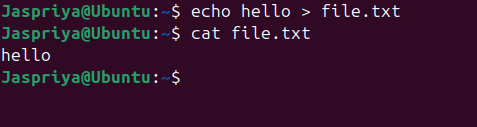
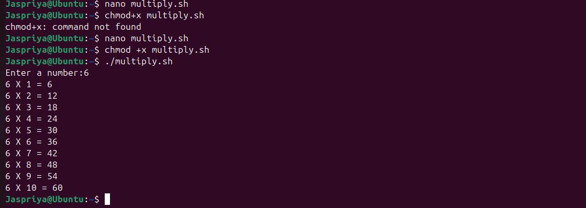

**The daily dairy**
# Day 01 :-
## Introduction
**What is Linux?**

Linux is a family of open-source operating systems , initially released by Linus Torvalds in 1991. It is an operating system, like Windows or macOS.It helps your computer run programs and talk to hardware (like your keyboard, screen, and internet).

**Why Learn Linux?**

1. Open Source and Free
2. Ideal for Developers 
3. Improves System Understanding
4. Better Security & Privacy
5. In-Demand Skill
6. It’s Everywhere

**Linux Distribution**

A Linux distribution is a complete Linux system made for different users. Ubuntu is one of the easiest and most popular distros for beginners who want to try Linux.

**What is Ubuntu?**
Ubuntu is one of the most popular Linux distributions. 
It's known for being:
- Beginner-friendly
- Free and open-source
- Regularly updated

**Difference between Linux and Windows**
 Feature             | Linux                                         | Windows                                      |
|--------------------|-----------------------------------------------|----------------------------------------------|
| **Type**           | Open-source operating system kernel + distros | Proprietary operating system by Microsoft    |
| **Cost**           | Mostly free to use                            | Usually paid license                         |
| **Source Code**    | Open source (anyone can view and modify)      | Closed source (proprietary)                  |
| **Security**       | Generally considered more secure              | Frequent target for malware, but improving   |
| **Software**       | Thousands of free and open-source apps        | Huge variety of commercial software          |
| **Installation**   | Various methods, often more technical         | Usually simple, guided installers            |

**Why Linux is better than Windows?**

Linux is better than Windows because it’s free, more secure, and highly customizable. It runs well on older hardware and offers strong support for developers. Plus, it respects your privacy.

## Installation of Linux

**Step 1: Download and Install VirtualBox**

VirtualBox is free software that lets you run virtual machines on your computer.

- Visit the official website: [https://www.virtualbox.org/](https://www.virtualbox.org/)
- Download the version for your operating system (Windows/macOS/Linux).
- Run the installer and follow the prompts to install VirtualBox.

**Step 2: Download Microsoft Visual C++ Redistributable**

Some applications need this to run properly on Windows.

- Go to the official Microsoft page: [https://learn.microsoft.com/en-US/cpp/windows/latest-supported-vc-redist](https://learn.microsoft.com/en-US/cpp/windows/latest-supported-vc-redist)
- Download the latest **x64** versions based on your system.
- Run the installers and follow instructions.

**Step 3: Download Ubuntu ISO**

Ubuntu is a popular Linux distribution.

- Go to [https://ubuntu.com/download/desktop](https://ubuntu.com/download/desktop)
- Download the latest Ubuntu Desktop ISO file.

**Step 4: Create a Virtual Machine and Install Ubuntu**

1. Open VirtualBox.
2. Click **New** to create a new virtual machine.
3. Name it “Ubuntu” and choose **Linux** as the type and **Ubuntu (64-bit)** as the version.
4. Assign memory (RAM).
5. Create a virtual hard disk.
6. After creating the VM, select it and click **Start**.
7. When prompted, browse to the downloaded Ubuntu ISO file.
8. Follow the on-screen instructions to install Ubuntu inside the VM.

---

**Step 5: Enjoy Ubuntu!**

Once installation finishes, you can start using Ubuntu inside VirtualBox.

## Study of some more concepts
**Difference between Product based , Service based companies and Startup**

| Feature                 | Product-based Companies                     | Service-based Companies                     | Startup                                                            |
|-------------------------|---------------------------------------------|---------------------------------------------|--------------------------------------------------------------------|
| **Definition**          | Build and sell their own products           | Provide services to clients/customers       | A new company aiming to solve a big problem in an innovative way   |
| **Revenue Model**       | Earn money by selling products              | Earn money by charging for services rendered| Usually a mix: early investment → selling product/service to scale |
| **Examples**            | Microsoft, Google, Apple                    | TCS, Infosys                                | Airbnb (home-booking), SpaceX (rockets), Stripe (digital payments) |
| **Focus**               | Product development and innovation          | Client satisfaction and project delivery    | Rapid growth, experimentation, market fit, scaling fast            |
| **Work Culture**        | Product lifecycle, feature updates          | Client deadlines, customization             | Fast decision-making,lean team                                     |

## Booting and its type
**What is Booting?**

Booting is the process of starting a computer. It loads the operating system (like Windows, Linux, or macOS) so the computer is ready to use.

 
 **Types of Booting** 
 
- **Cold Boot (Hard Boot):**

When you turn on a computer from a completely powered-off state.
Example: Pressing the power button to start your PC.

- **Warm Boot (Soft Boot):**

When you restart the computer without turning off the power.
Example: Clicking "Restart" or pressing Ctrl + Alt + Del.

# Day 02 
## Kernel

**What is a Kernel?**

The kernel is the core part of an operating system. It acts like a bridge between hardware and software.

**What the Kernel Does:**

Talks to the hardware (CPU, memory, devices)
Manages system resources (like files, memory, and processes)
Helps apps and the OS work together smoothly

## Introduction to Shell and Bash

**What is a Shell?**

A Shell is a program that lets you interact with your computer by typing commands. Shell acts as an interface between the user and the operating system software, allowing users to execute commands.

**Types of Shells**

*Bash* — The Workhorse: 

The most popular shell out there. It’s the everyday hero of Linux and macOS users.

*Sh* — The Classic: 

The original shell that’s simple, reliable, and works almost everywhere. Perfect if you like things straightforward and old-school.

*zsh* — The Customizer: 

Like bash, but with extra flair! It supports themes, plugins, and fancy auto-completion to make your terminal both powerful and stylish.

*fish* — The Friendly: 

Designed to be super user-friendly with colors, autosuggestions, and helpful hints right out of the box — ideal for beginners and pros who want to save time.

**Categories of Shells**

*Command Line Shells*

Let you type commands to control your computer.
Examples: bash, sh, zsh, fish.

*Graphical Shells*

Provide a visual interface with windows, icons, and menus.
Examples: Windows Explorer, macOS Finder.

## File System Structure

A file system structure is the way an operating system organizes, stores, and manages files on a storage device (like a hard drive, SSD, or USB). It defines how data is named, stored, and retrieved.

- / — Root directory (the starting point of the file system)

- /bin — Essential user binaries (programs)

- /boot — Files needed to boot the system (like the kernel)

- /dev — Device files representing hardware

- /etc — System-wide configuration files

- /home — Users’ personal directories (e.g., /home/alice)

- /lib — Essential shared libraries for programs

- /media — Mount points for removable media (USB, CDs)

- /mnt — Temporary mount points for filesystems

- /opt — Optional add-on software packages

- /srv — It is used to store data for services that run on the system.

- /root — Home directory of the root user (superuser)

- /sbin — System binaries (programs for admin tasks)

- /tmp — Temporary files

- /usr — User programs and data (many subdirectories)

- /var — Variable files like logs, mail, and caches

## Basic Shell Command (Linux)

- **ls**

List files and folders in the current directory

Syntax:-ls

  

- **whoami**
  
The whoami command shows the username of the current user logged into the shell.

Syntax:-whoami

- **date**

The date command in Linux is used to display the current date and time.
 
Syntax:-date

- **cd**
  
Change directory (e.g., cd Documents)
 
Syntax:- cd [directory_path]

- **mkdir**

Create a new directory,if already exist,error is displayed

Syntax:-mkdir [folder_name]

- **cat**

Creates the content of a file.

Syntax:-cat file.txt

- **touch**

Creates an empty file.

Syntax:-touch [file_name]

- **cp**

Copies files or folders.

Syntax:-cp source.txt destination.txt

- **pwd**

Shows the current directory path.

Syntax:- pwd

- **whereis**

Finds the location of a binary (executable), source, and manual page for a command.

Syntax:- whereis [command_name]

- **whatis**

Gives a short one-line description of a command — great for quick help!

Syntax:-whatis [command_name]

- **mv**

Moves or renames files/directories.

Syntax:-mv oldname.txt newname.txt  

- **clear** 

Clears the terminal screen.

Syntax:-clear

- **exit**

Closes the terminal or shell session.

Syntax:-exit

- **echo command**

The echo command  is used to print text or variables on the screen.

Syntax:- echo [text or variable]

***editor Command***

The term "editor command" usually refers to opening a text editor from the terminal to create or edit files.
It includes:-
- **nano command**

Opens the file (or creates it) in the Nano editor.

Syntax:-nano filename.txt

- Go back one step
  
Syntax:- cd ..

This moves you up one level (like going back to the previous folder).
  
 

# Day 03

## What is Bare Metal Installation?
Bare metal installation means installing an operating system (OS) directly onto a computer or server that has no software or OS installed — just the hardware.

 
**Example:**

You have a brand-new laptop or server — it has:

No Windows

No Linux

No programs

It’s just the bare hardware (CPU, hard drive, etc.).

You plug in a USB drive with an OS installer (like Windows or Ubuntu), start the computer, and install the OS.
That’s a bare metal installation.

## What Is a Partitioning Scheme?

A partitioning scheme is the way a computer’s hard drive is divided into separate sections (called partitions) so that the operating system (OS) and data can be stored and managed properly.

**Types of Partitioning Schemes:**

| Feature        | MBR (Master Boot Record)                        | GPT (Guided Partition Table)                         |
|----------------|------------------------------|-------------------------------|
| Disk Size      | Up to 2 TB                   | More than 2 TB                |
| Partitions     | Up to 4                      | Over 100                      |
| Example        | Use **MBR** only for old ones| Use **GPT** for new computers |

## ISO file

An ISO file is a copy of a whole CD, DVD, or software disc saved in one single file on your computer.

**What Is It Used For?**

- Installing operating systems (like Windows, Linux)

- Backing up CDs/DVDs

## Virtual Box and VM Ware

**VirtualBox**

VirtualBox is a free software that lets you create and run virtual machines — which means you can run one operating system (like Linux or Windows) inside another (like your current Windows or macOS) without restarting your computer.

**VMware**
VMware is a company that makes software for running virtual machines. Their popular product, VMware Workstation Player, lets you run another operating system inside your current one, similar to VirtualBox, often with better performance and features for professional use.

| Feature            | VirtualBox                            | VMware Workstation Player               |
|--------------------|---------------------------------------|-----------------------------------------|
| License            | Free & Open Source                    | Free for personal use                   |
| OS Support         | Windows, Linux, macOS, Solaris        | Windows, Linux                          |
| Performance        | Good                                  | Often better, especially graphics       |
| Ease of Use        | Beginner-friendly                     | Polished, slightly more advanced        |

**VirtualBox** is great for learning and testing.  

**VMware** is ideal for better performance and professional use.

 ## Dual boot
 
 Dual boot means installing two operating systems (like Windows and Linux) on the same computer. When you turn on your computer, you get a choice to pick which OS you want to use.

## What is Slash ( / ) Full Disk?

When someone says the slash ( / ) is full, it means the main system partition (called the root partition, represented by / in Linux) has no more free space left.

## File and Directory Permissions in Linux

Linux controls who can read, write, or execute files and directories using permissions.

**How to Change Permissions**

Use the command:

chmod [options] filename

- ## chmod

chmod stands for change mode. It’s a Linux command used to change the permissions of files or directories.

Syntax:- **chmod [options] mode filename]**

## chmod +x

Syntax:-**chmod +x filename.sh**

| Term           | Description                                                 |
|----------------|-------------------------------------------------------------|
| `chmod`        | Command to **change file permissions** in Linux.            |
| `+x`           | Adds **execute permission**, making the file runnable.      |
| `filename.sh`  | The **script file** you want to make executable.            |

If you have a shell script (.sh file), it needs execute permission before you can run it.

**chmod +x filename.sh**

This makes the script runnable. Then you can execute it by typing:

**./filename.sh**

## chmod 444

chmod 444 changes a file's permissions to read-only for everyone (owner, group, and others). This means that all users can read the file but cannot modify, delete, or execute it. 

Syntax:-**chmod 444 filename.sh**

| Term       | Description                                                  |
|------------|--------------------------------------------------------------|
| `chmod`    | Command used to **change file permissions** in Linux.        |
| `4`        | Represents **read permission** (`r--`) in numeric form.       |
| `444`      | Sets **read-only permission** for **owner, group, and others**. |

## chmod 666

chmod 666 file/foldermeans that all users can read and write but cannot execute the file/folder

Syntax:- **chmod 666 filename**

| Term         | Description                                                                 |
|--------------|-----------------------------------------------------------------------------|
| `chmod`      | Command used to **change file permissions** in Linux.                       |
| `666`        | Sets **read+ write** permissions for **owner, group, others**. |
| `filename`   | The name of the file you want to apply the permission change to.            |

- ##  chown

chown stands for change ownership.

It's a Linux command used to change the owner or group of a file or directory.

Syntax:-
**chown [new_owner]:[new_group] filename**

| Term         | Description                                         |
|--------------|-----------------------------------------------------|
| `new_owner`  | The **new user** who should own the file or folder. |
| `new_group`  | *(Optional)* The **new group** to assign ownership. |
| `filename`   | The **file or directory** whose ownership is changed. |

## ECHO

You can create a file and even write text into it using echo with output redirection.

## Redirection

Redirection means sending the output or input of a command to somewhere else — like a file instead of the screen.

***Redirection Operator***

| Operator | Description                          | Example                         | Meaning                                |
|----------|--------------------------------------|----------------------------------|----------------------------------------|
| `>`      | Redirect output (overwrite file)     | `echo Hello > file.txt`          | Writes "Hello" to file.txt, replaces content |
| `>>`     | Redirect output (append to file)     | `echo World >> file.txt`         | Adds "World" to the end of file.txt    |
| `<`      | Redirect input (read from file)      | `wc -l < file.txt`               | Counts lines in file.txt as input      |

## Pipes

**What is a Pipe in Linux?**

A pipe (|) is used to connect two commands so that the output of the first becomes the input of the second.

Syntax:-
command1 | command2

| Element     | Description                                           |
|-------------|-------------------------------------------------------|
| `command1`  | Runs first and **sends its output** to the pipe.      |
| `|`         | The **pipe operator**, connects commands.             |
| `command2`  | Takes the **output of command1 as input**.            |

## Shell Examples

***1. To display Name, Age, City of a user***

***2. Multiplication of a number upto 10***

***3. Compare two numbers***

## File Compression

File compression is the process of reducing the size of a file or group of files to save storage space and make data transmission more efficient

***Why Use File Compression?***
- Save Storage Space: Compressed files take up less disk space, allowing you to store more data.

- Faster Transmission: Smaller files transfer more quickly over networks, reducing upload and download times.

- Efficient Sharing: Easier to share large files via email or cloud services.

- Cost-Effective: Reduces bandwidth usage and storage costs.

## GZIP(GNU zip)

Gzip (short for GNU Zip) is a widely used tool and file format for compressing data. It reduces the size of files, making them easier and faster to store or transfer, without losing any information.

Syntax:-**gzip filename**

**Compress a File**
To compress a file named **example.txt**, use the following command:

- **gzip example.txt**

This command will compress **example.txt** and create a new file named **example.txt.gz**, replacing the original file.

- **Decompress a File**

To decompress **example.txt.gz** you can use the **gunzip command**, which is equivalent:

**gunzip example.txt.gz**

This will decompress the file and remove the **.gz** extension, restoring the original **example.txt** file.

- **Keep the Original File**

To compress a file and keep the original, use the -k option:

**gzip -k example.txt**
  
This will create **example.txt.gz** without deleting **example.txt**.

## Wildcards

Wildcards let you match filenames or strings with patterns. They're often used with commands like ls, cp, mv, and rm.

| Wildcard | Meaning                      | Example                      |
|----------|------------------------------|------------------------------|
| *      | Matches zero or more characters | *.txt matches all .txt files |
| ?      | Matches exactly one character | file?.txt matches file1.txt, fileA.txt |
| [abc]  | Matches one character listed  | file[123].txt matches file1.txt, file2.txt, or file3.txt |
|[a-z]   |  match exactly one character that is any lowercase letter | file[a-z].txt matches filea.txt, fileb.txt, but not file1.txt or fileA.txt |

## Escaping Characters

Escaping characters means using a special symbol (usually a backslash \) before a character to tell the computer to treat that character literally, not as a special or reserved symbol.

| Character to Escape | How to Escape                | Purpose / Meaning                                      | Example                                     |
|--------------------|-----------------------------|-------------------------------------------------------|---------------------------------------------|
| Space (` `)         | Use backslash `\ ` or quotes | To treat space as part of filename or command argument | `file\ name.txt` or `"file name.txt"`       |
| Backslash (`\`)     | Use double backslash `\\`    | To represent a literal backslash                        | `echo \\` prints `\`                         |
| Dollar sign (`$`)   | Use backslash `\$`           | To prevent variable expansion                           | `echo \$HOME` prints `$HOME`                 |
| Asterisk (`*`)      | Use backslash `\*`           | To treat `*` literally, not as a wildcard               | `ls \*.txt` lists files named `*.txt` literally |
| Question mark (`?`)| Use backslash `\?`           | To treat `?` literally, not as a single-character wildcard | `ls file\?.txt` matches `file?.txt` literally |
| Quotes (`"` or `'`)| Use backslash `\"` or `\'` inside quotes, or use different quote type | To include quotes in strings                      | `echo "He said \"Hi\""`                       |
| Brackets (`[ ]`)    | Use backslash `\[` and `\]` | To treat brackets literally                             | `ls file\[1\].txt` matches `file[1].txt`    |

## Quoting in Linux

Quoting in Linux means using special characters (quotes) to preserve the literal value of characters or to group text so that the shell treats them as a single unit or literal string.

***Why quoting is used?***

- To prevent the shell from interpreting special characters like spaces, $, *, or ?

- To pass strings with spaces or special symbols as one argument

| Quote Type    | Syntax    | Behavior                                                                                      | Example                             |
|---------------|-----------|-----------------------------------------------------------------------------------------------|-----------------------------------|
| Single quotes | `'text'` | Preserves **literal value** of all characters inside                                          | `'Hello $USER * ?'` outputs exactly `Hello $USER * ?` |
| Double quotes | `"text"` | Preserves most characters literally, but **allows variable expansion** and command substitution | `"Hello $USER"` outputs `Hello` followed by your username |
| Backslash     | `\char`   | Escapes the next character to be treated literally    

# Day 04:-

## Hardware

Hardware refers to the tangible, physical components of a computer system or electronic device that enable data processing, storage, input, and output operations.
It refers to the physical components of a computer or electronic system that you can see and touch.

| Hardware Type       | Description                                         | Examples                          |
|---------------------|-----------------------------------------------------|----------------------------------|
| Input Devices       | Devices that allow users to input data into a computer | Keyboard, Mouse, Scanner, Microphone |
| Output Devices      | Devices that output data from the computer to the user | Monitor, Printer, Speakers       |
| Processing Units    | Components that process data and execute instructions | CPU (Central Processing Unit), GPU (Graphics Processing Unit) |
| Storage Devices     | Devices used to store data permanently or temporarily | Hard Drive (HDD), Solid State Drive (SSD), USB Flash Drive |
| Memory              | Temporary storage used by the CPU to hold data and instructions | RAM (Random Access Memory), Cache |
| Motherboard         | The main circuit board that connects all hardware components | Motherboard                     |
| Power Supply Units  | Provides electrical power to all components          | PSU (Power Supply Unit)           |
| Networking Hardware | Devices that connect computers and enable communication | Network Interface Card (NIC), Router, Switch |

## Motherboard
The motherboard is the main printed circuit board (PCB) in a computer or electronic device. It serves as the central backbone that connects and allows communication between all hardware components such as the CPU, memory (RAM), storage devices, power supply, and peripherals.

| Component           | Description                                                        |
|---------------------|--------------------------------------------------------------------|
| CPU Socket          | The slot where the processor (CPU) is installed                     |
| RAM Slots (DIMM)    | Slots for installing memory modules (RAM)                           |
| Chipset             | Manages data flow between CPU, memory, and peripherals              |
| BIOS/UEFI Chip      | Firmware that initializes hardware during boot-up                   |
| Power Connectors    | Connectors for power supply to distribute electricity to components |
| Expansion Slots     | Slots (PCI, PCIe) for adding graphics cards, network cards, etc.    |
| SATA Ports          | Connectors for storage devices like HDDs and SSDs                   |
| M.2 Slots           | Connectors for modern high-speed SSDs                               |
| CMOS Battery        | Powers the BIOS memory to retain settings when the PC is off        |
| USB Headers         | Connectors for USB ports on the front or back panel                 |
| Audio Connectors    | Ports for audio input/output devices                                |
| Network Port (Ethernet) | Connector for wired network connections                          |

# Day 05:-

## PC & Network Troubleshooting

##                                                                               Common issues and Problems in PC:

***GPU (Graphics processor unit)***

The GPU handles rendering of images, video, and animations. It’s essential for gaming, video editing, and applications that require parallel processing.

**Common Symptoms of GPU Issues**

| **Symptom**                        | **Description**                                                                  |
|------------------------------------|----------------------------------------------------------------------------------|
| No display / black screen          | Monitor shows no signal; system powers on but there's no video output           |
| Screen artifacts / visual glitches | Weird lines, colors, or shapes on screen; may indicate VRAM or overheating issues|
| Freezing or crashing in games      | Games crash to desktop or the system reboots; often related to thermal issues   |
| GPU fan not spinning               | Fan stuck due to dust, failure, or low temp thresholds in passive cooling GPUs  |
| Driver crashes / BSOD              | Display driver stops responding (e.g., `nvlddmkm.sys`, `atikmdag.sys`)          |
| System doesn’t boot with GPU       | PC powers on but won’t POST or display; works without GPU or with another one   |
| Loud fan noise under low load      | Malfunctioning fan curve or temperature sensor issues                           |
| Flickering or blanking screen      | Loose cables, unstable overclock, or power issues   

***Partitioning of Hard Disk***

Partitioning divides a physical hard disk into multiple logical sections called partitions. Each partition can be formatted with a file system and assigned a drive letter, acting like separate drives.

| Partition Type      | What It Is                        | Purpose                         |
|---------------------|---------------------------------|--------------------------------|
| Extended Partition  | A special partition that holds logical partitions | Lets you create more partitions than the MBR limit |
| Logical Partition   | A partition inside the extended partition | Used to store files and data    |

 ***Installation & Hard Disk Preparation: Partitioning***
 
Partitioning is the process of dividing a hard disk into separate sections called partitions. This helps organize data and improves system management.

**Primary Partition (C: Drive)**

- This is where the operating system (Windows, Linux, Unix) is installed.

- It contains all system files required to boot and run the OS.

- Important: Avoid storing personal or important files here because if the OS crashes or needs to be reinstalled, these files may be lost.

**Logical Drives (D:, E:, F:)**

- These are additional partitions created within an extended partition.

- They are typically used for storing personal data such as pictures, videos, documents, and other files.

- Storing files here keeps them safer because these partitions are often unaffected if the OS partition crashes.

- This setup also makes backing up and recovering personal files easier.

**Best Practices**

- Install the OS only on the C: drive.

- Avoid storing personal or important files on C:, because if Windows crashes or needs a reinstall, those files may be lost.

- Store all important data (e.g., photos, videos, documents) in logical drives (D:, E:, F:), which are often safe from OS-related crashes.

## CAUSES AND FIXES OF SLOW SPEED OF PC

| **Cause**                | **Explanation**                                                                                      | **Fix / Recommendation**                                                                                 |
|--------------------------|----------------------------------------------------------------------------------------------------|----------------------------------------------------------------------------------------------------------|
| **Desktop Clutter**       | Files on Desktop are stored on the C: drive by default, increasing system load.                    | Avoid keeping many folders/files on Desktop; move them to other drives (D:, E:, etc.).                    |
| **Taskbar Shortcuts**     | Too many shortcuts can slow down system responsiveness.                                            | Keep minimal shortcuts on the taskbar.                                                                   |
| **Browser Bookmarks**     | Excessive bookmarks can slow browser startup time.                                                 | Avoid storing too many bookmarks; organize and clean bookmarks regularly.                                |
| **Temporary Files**       | Websites and apps create temp files, cookies, and caches that accumulate and slow the system.      | Regularly clear temporary files using system tools or cleanup utilities.                                 |
| **RAM Overuse**           | Opening many applications or browser tabs consumes available RAM, slowing down the system.         | Limit the number of running apps/tabs; close unused programs.                                            |
| **Malware Infection**     | Malware can consume system resources and degrade performance.                                      | Perform regular malware scans and keep antivirus software updated.                                      |
| **Disk Fragmentation**    | Fragmented files cause delays in file access and reduce system efficiency.                          | Use **Defragment and Optimize Drives** tool: Go to *Start → Defragment and Optimize Drives* and schedule automatic defragmentation. |

## System scanning and defragmentation

### Optimization

Optimization means making your computer or software work faster and more efficiently. It involves cleaning up unnecessary files, fixing errors, managing startup programs, and adjusting settings so everything runs smoothly.

By optimizing your system, you can improve speed, reduce crashes, and get better overall performance

### System Scanning and Antivirus Scanner

### What is System Scanning?

System scanning is the process of checking your computer for malicious software such as viruses, malware, spyware, and other security threats that can harm your system or slow it down.

---

### Why Use an Antivirus Scanner?

- Detects and removes viruses and malware.
- Protects personal data and system files.
- Prevents unauthorized access or damage.
- Keeps your system running smoothly.

---

### Defragment and Optimize Drives

### What is Defragmentation?

When files are saved, deleted, or modified, they can become fragmented — meaning parts of a file are scattered across the disk. This fragmentation slows down file access and overall system performance.

Defragmentation rearranges fragmented files so they are stored contiguously, improving speed and efficiency.

Keeping your system scanned and defragmented helps maintain smooth and fast performance.

### Scheduled Optimization

- **What is it?**  
  Scheduled Optimization is an automatic process where Windows regularly defragments and optimizes your hard drives to keep them running efficiently.
  
*Why it’s important:**

  Regular optimization keeps HDDs running smoothly and ensures SSDs maintain performance by running TRIM operations.

---

### Delivery Optimization

- **What is it?**  
  Delivery Optimization is a Windows feature that helps manage and speed up downloading Windows updates and Microsoft Store apps by using peer-to-peer (P2P) sharing across your local network or the internet.

## Printer Problems and Solutions

| **Problem**               | **Possible Cause**                         | **Solution**                                         |
|---------------------------|--------------------------------------------|-----------------------------------------------------|
| Printer not printing      | Printer offline or not connected           | Check printer power and cable connections. Set printer online in system settings. |
| Paper jams                | Paper stuck inside the printer              | Open printer cover and gently remove jammed paper. Make sure to use correct paper size and quality. |
| Poor print quality        | Low ink/toner or dirty print heads          | Replace ink or toner cartridges. Clean print heads via printer software.             |
| Printer driver issues     | Outdated or corrupt printer drivers         | Update or reinstall printer drivers from manufacturer’s website.                      |
| Printer not recognized   | USB/Network connectivity issues              | Check USB cable or network connection. Restart printer and PC.                        |
| Slow printing            | Large print jobs or low memory               | Reduce print job size or increase printer memory if possible.                         |
| Wireless printer not found| Wi-Fi connection problems                     | Ensure printer and PC are on the same network. Restart router and printer.            |

---

### Tips for Printer Maintenance

- Regularly update printer drivers.
  
- Use recommended paper and ink/toner.
  
- Keep printer clean and free of dust.

-  Restart printer and computer if issues persist.
  
- Consult printer manual for model-specific troubleshooting.

---

### Benefits of update

Keeping your PC updated is crucial for maintaining optimal performance, security, and compatibility. Here are the key benefits:

| Benefit                      | Description                                                                                   |
|------------------------------|----------------------------------------------------------------------------------------------|
| **1. Security Enhancements**  | - Patches vulnerabilities to protect against malware, viruses, and cyber attacks. Keeps your system safe from newly discovered threats. |
| **2. Performance Improvements** | - Optimizes system speed and responsiveness.   - Fixes bugs that may slow down your computer. |
| **3. New Features & Functionalities** | - Adds new tools and features.   - Improves existing functionalities for better user experience. |
| **4. Bug Fixes**              | - Resolves errors and glitches.   - Reduces system crashes and unexpected behaviors.        |
| **5. Compatibility Updates** | - Ensures compatibility with the latest

---

## PC Hardware Troubleshooting

### Blue Screen of Death (BSOD)

The **BSOD** is a Windows error screen shown after a serious system crash that forces a restart.

 ***Common Causes***
 
- Faulty hardware (RAM, HDD)
  
- Driver issues (outdated or corrupt)
  
- Software conflicts or corrupted system files
  
- Malware infections

***What Happens***

- System stops all operations
  
- Blue screen with error code appears
 
- Automatic or manual restart follows

## System Crash Analysis

System Crash Analysis is the process of diagnosing why a Windows system crashes, such as during a Blue Screen of Death (BSOD), to identify and fix the root cause.

## Key Concepts

### Dump Files

When Windows crashes, it creates **dump files**—snapshots of system memory at the crash moment. These files contain critical information to analyze the error and are usually saved on the **C: drive** in locations like:

Having sufficient free space on the C: drive is essential to allow these files to be saved.

### Windows Debugging
Windows debugging involves using specialized tools to analyze dump files and understand the crash cause. Common tools include:

- **WinDbg**: Microsoft's official debugger for detailed dump analysis.
 
- **BlueScreenView**: A simpler tool that summarizes BSOD dump files.

Debugging helps identify:
- Faulty drivers or system files
- Hardware issues
- Software conflicts

## Role of the C: Drive
- Stores dump files and system logs
- Houses Windows OS files required for crash analysis
- Needs enough space to save crash dumps; without it, useful diagnostic data may be lost

## Basic Crash Analysis Workflow
1. Locate dump files on the C: drive.  
2. Use debugging tools (WinDbg or BlueScreenView) to analyze the dumps.  
3. Identify error codes and faulting modules or drivers.  
4. Review Windows Event Viewer for related system events.  
5. Test hardware components if indicated.  
6. Update, rollback, or reinstall drivers/software as needed.  
7. Monitor system for stability after applying fixes.

---

## ASSIGNMENT

## BIOS/UEFI Settings and POST Errors

## BIOS/UEFI Settings

- **BIOS (Basic Input/Output System)** and **UEFI (Unified Extensible Firmware Interface)** are firmware interfaces that initialize hardware during the boot process before handing control to the operating system.
- They allow configuration of system settings such as boot order, hardware enable/disable, system clocks, security features, and power management.
- UEFI is a modern replacement for BIOS, offering faster boot times, support for large drives, graphical interfaces, and secure boot options.

## POST (Power-On Self Test)

- When you power on a PC, the firmware runs the **POST** to check if the critical hardware components (CPU, RAM, GPU, storage devices, etc.) are functioning properly.
- If POST detects issues, it may halt the boot process and signal errors via beep codes or error messages on screen.

## Common POST Errors and Their Meanings

| Error Type      | Description                                 | Possible Causes                         |
|-----------------|---------------------------------------------|---------------------------------------|
| Beep Codes      | Series of beeps indicating hardware issues | Faulty RAM, graphics card, motherboard, or CPU |
| No Display      | Blank screen after POST                     | GPU failure, loose cables, or bad monitor |
| CMOS Checksum Error | BIOS settings corrupted or reset        | Dead CMOS battery or corrupted BIOS firmware |
| Keyboard Errors | Keyboard not detected                        | Faulty or disconnected keyboard       |
| Memory Errors   | RAM test failure                            | Defective or improperly seated RAM    |

