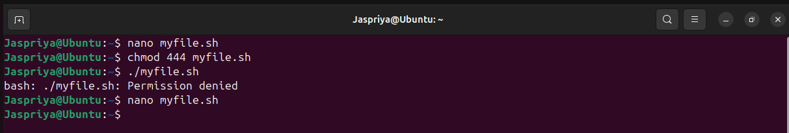
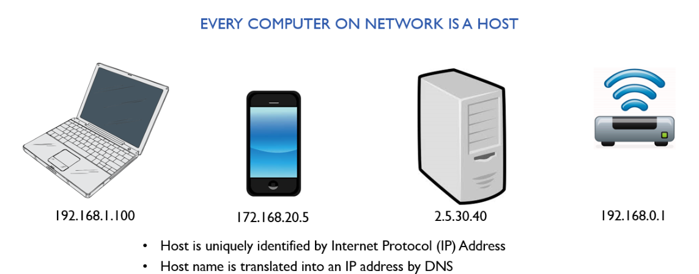
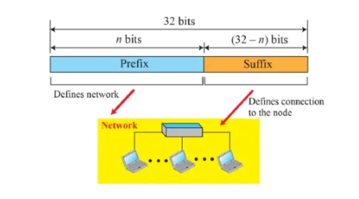
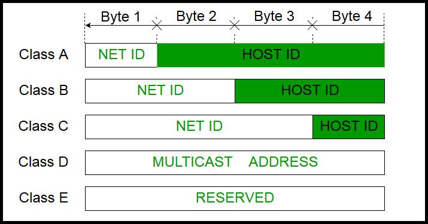
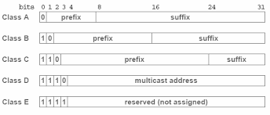

**The daily dairy**
# Day 01 :-
## Introduction
**What is Linux?**

Linux is a family of open-source operating systems , initially released by Linus Torvalds in 1991. It is an operating system, like Windows or macOS.It helps your computer run programs and talk to hardware (like your keyboard, screen, and internet).

**Why Learn Linux?**

1. Open Source and Free
2. Ideal for Developers 
3. Improves System Understanding
4. Better Security & Privacy
5. In-Demand Skill
6. It’s Everywhere

**Linux Distribution**

A Linux distribution is a complete Linux system made for different users. Ubuntu is one of the easiest and most popular distros for beginners who want to try Linux.

**What is Ubuntu?**
Ubuntu is one of the most popular Linux distributions. 
It's known for being:
- Beginner-friendly
- Free and open-source
- Regularly updated

**Difference between Linux and Windows**
 Feature             | Linux                                         | Windows                                      |
|--------------------|-----------------------------------------------|----------------------------------------------|
| **Type**           | Open-source operating system kernel + distros | Proprietary operating system by Microsoft    |
| **Cost**           | Mostly free to use                            | Usually paid license                         |
| **Source Code**    | Open source (anyone can view and modify)      | Closed source (proprietary)                  |
| **Security**       | Generally considered more secure              | Frequent target for malware, but improving   |
| **Software**       | Thousands of free and open-source apps        | Huge variety of commercial software          |
| **Installation**   | Various methods, often more technical         | Usually simple, guided installers            |


**Why Linux is better than Windows?**

Linux is better than Windows because it’s free, more secure, and highly customizable. It runs well on older hardware and offers strong support for developers. Plus, it respects your privacy.


## Installation of Linux

**Step 1: Download and Install VirtualBox**

VirtualBox is free software that lets you run virtual machines on your computer.

- Visit the official website: [https://www.virtualbox.org/](https://www.virtualbox.org/)
- Download the version for your operating system (Windows/macOS/Linux).
- Run the installer and follow the prompts to install VirtualBox.


**Step 2: Download Microsoft Visual C++ Redistributable**

Some applications need this to run properly on Windows.

- Go to the official Microsoft page: [https://learn.microsoft.com/en-US/cpp/windows/latest-supported-vc-redist](https://learn.microsoft.com/en-US/cpp/windows/latest-supported-vc-redist)
- Download the latest **x64** versions based on your system.
- Run the installers and follow instructions.


**Step 3: Download Ubuntu ISO**

Ubuntu is a popular Linux distribution.

- Go to [https://ubuntu.com/download/desktop](https://ubuntu.com/download/desktop)
- Download the latest Ubuntu Desktop ISO file.

**Step 4: Create a Virtual Machine and Install Ubuntu**

1. Open VirtualBox.
2. Click **New** to create a new virtual machine.
3. Name it “Ubuntu” and choose **Linux** as the type and **Ubuntu (64-bit)** as the version.
4. Assign memory (RAM).
5. Create a virtual hard disk.
6. After creating the VM, select it and click **Start**.
7. When prompted, browse to the downloaded Ubuntu ISO file.
8. Follow the on-screen instructions to install Ubuntu inside the VM.

---

**Step 5: Enjoy Ubuntu!**

Once installation finishes, you can start using Ubuntu inside VirtualBox.


## Study of some more concepts
**Difference between Product based , Service based companies and Startup**

| Feature                 | Product-based Companies                     | Service-based Companies                     | Startup                                                            |
|-------------------------|---------------------------------------------|---------------------------------------------|--------------------------------------------------------------------|
| **Definition**          | Build and sell their own products           | Provide services to clients/customers       | A new company aiming to solve a big problem in an innovative way   |
| **Revenue Model**       | Earn money by selling products              | Earn money by charging for services rendered| Usually a mix: early investment → selling product/service to scale |
| **Examples**            | Microsoft, Google, Apple                    | TCS, Infosys                                | Airbnb (home-booking), SpaceX (rockets), Stripe (digital payments) |
| **Focus**               | Product development and innovation          | Client satisfaction and project delivery    | Rapid growth, experimentation, market fit, scaling fast            |
| **Work Culture**        | Product lifecycle, feature updates          | Client deadlines, customization             | Fast decision-making,lean team                                     |


## Booting and its type
**What is Booting?**

Booting is the process of starting a computer. It loads the operating system (like Windows, Linux, or macOS) so the computer is ready to use.

 
 **Types of Booting** 
 
- **Cold Boot (Hard Boot):**

When you turn on a computer from a completely powered-off state.
Example: Pressing the power button to start your PC.

- **Warm Boot (Soft Boot):**

When you restart the computer without turning off the power.
Example: Clicking "Restart" or pressing Ctrl + Alt + Del.

# Day 02 
## Kernel

**What is a Kernel?**

The kernel is the core part of an operating system. It acts like a bridge between hardware and software.


**What the Kernel Does:**

Talks to the hardware (CPU, memory, devices)
Manages system resources (like files, memory, and processes)
Helps apps and the OS work together smoothly


## Introduction to Shell and Bash

**What is a Shell?**

A Shell is a program that lets you interact with your computer by typing commands. Shell acts as an interface between the user and the operating system software, allowing users to execute commands.


**Types of Shells**

*Bash* — The Workhorse: 

The most popular shell out there. It’s the everyday hero of Linux and macOS users.

*Sh* — The Classic: 

The original shell that’s simple, reliable, and works almost everywhere. Perfect if you like things straightforward and old-school.

*zsh* — The Customizer: 

Like bash, but with extra flair! It supports themes, plugins, and fancy auto-completion to make your terminal both powerful and stylish.

*fish* — The Friendly: 

Designed to be super user-friendly with colors, autosuggestions, and helpful hints right out of the box — ideal for beginners and pros who want to save time.


**Categories of Shells**

*Command Line Shells*

Let you type commands to control your computer.
Examples: bash, sh, zsh, fish.

*Graphical Shells*

Provide a visual interface with windows, icons, and menus.
Examples: Windows Explorer, macOS Finder.


## File System Structure

A file system structure is the way an operating system organizes, stores, and manages files on a storage device (like a hard drive, SSD, or USB). It defines how data is named, stored, and retrieved.


- / — Root directory (the starting point of the file system)

- /bin — Essential user binaries (programs)

- /boot — Files needed to boot the system (like the kernel)

- /dev — Device files representing hardware

- /etc — System-wide configuration files

- /home — Users’ personal directories (e.g., /home/alice)

- /lib — Essential shared libraries for programs

- /media — Mount points for removable media (USB, CDs)

- /mnt — Temporary mount points for filesystems

- /opt — Optional add-on software packages

- /srv — It is used to store data for services that run on the system.

- /root — Home directory of the root user (superuser)

- /sbin — System binaries (programs for admin tasks)

- /tmp — Temporary files

- /usr — User programs and data (many subdirectories)

- /var — Variable files like logs, mail, and caches


## Basic Shell Command (Linux)

- **ls**

List files and folders in the current directory

Syntax:-ls


  

- **whoami**
  
The whoami command shows the username of the current user logged into the shell.

Syntax:-whoami


- **date**

The date command in Linux is used to display the current date and time.
 
Syntax:-date


- **cd**
  
Change directory (e.g., cd Documents)
 
Syntax:- cd [directory_path]


- **mkdir**

Create a new directory,if already exist,error is displayed

Syntax:-mkdir [folder_name]


- **cat**

Creates the content of a file.

Syntax:-cat file.txt


- **touch**

Creates an empty file.

Syntax:-touch [file_name]


- **cp**

Copies files or folders.

Syntax:-cp source.txt destination.txt


- **pwd**

Shows the current directory path.

Syntax:- pwd


- **whereis**

Finds the location of a binary (executable), source, and manual page for a command.

Syntax:- whereis [command_name]


- **whatis**

Gives a short one-line description of a command — great for quick help!

Syntax:-whatis [command_name]


- **mv**

Moves or renames files/directories.

Syntax:-mv oldname.txt newname.txt  


- **clear** 

Clears the terminal screen.

Syntax:-clear


- **exit**

Closes the terminal or shell session.

Syntax:-exit


- **echo command**

The echo command  is used to print text or variables on the screen.

Syntax:- echo [text or variable]


***editor Command***

The term "editor command" usually refers to opening a text editor from the terminal to create or edit files.
It includes:-
- **nano command**

Opens the file (or creates it) in the Nano editor.

Syntax:-nano filename.txt


- Go back one step
  
Syntax:- cd ..

This moves you up one level (like going back to the previous folder).
  
 


# Day 03

## What is Bare Metal Installation?
Bare metal installation means installing an operating system (OS) directly onto a computer or server that has no software or OS installed — just the hardware.

 
**Example:**

You have a brand-new laptop or server — it has:

No Windows

No Linux

No programs

It’s just the bare hardware (CPU, hard drive, etc.).

You plug in a USB drive with an OS installer (like Windows or Ubuntu), start the computer, and install the OS.
That’s a bare metal installation.


## What Is a Partitioning Scheme?

A partitioning scheme is the way a computer’s hard drive is divided into separate sections (called partitions) so that the operating system (OS) and data can be stored and managed properly.

**Types of Partitioning Schemes:**


| Feature        | MBR (Master Boot Record)                        | GPT (Guided Partition Table)                         |
|----------------|------------------------------|-------------------------------|
| Disk Size      | Up to 2 TB                   | More than 2 TB                |
| Partitions     | Up to 4                      | Over 100                      |
| Example        | Use **MBR** only for old ones| Use **GPT** for new computers |


## ISO file

An ISO file is a copy of a whole CD, DVD, or software disc saved in one single file on your computer.

**What Is It Used For?**

- Installing operating systems (like Windows, Linux)

- Backing up CDs/DVDs

## Virtual Box and VM Ware

**VirtualBox**

VirtualBox is a free software that lets you create and run virtual machines — which means you can run one operating system (like Linux or Windows) inside another (like your current Windows or macOS) without restarting your computer.

**VMware**
VMware is a company that makes software for running virtual machines. Their popular product, VMware Workstation Player, lets you run another operating system inside your current one, similar to VirtualBox, often with better performance and features for professional use.


| Feature            | VirtualBox                            | VMware Workstation Player               |
|--------------------|---------------------------------------|-----------------------------------------|
| License            | Free & Open Source                    | Free for personal use                   |
| OS Support         | Windows, Linux, macOS, Solaris        | Windows, Linux                          |
| Performance        | Good                                  | Often better, especially graphics       |
| Ease of Use        | Beginner-friendly                     | Polished, slightly more advanced        |

**VirtualBox** is great for learning and testing.  

**VMware** is ideal for better performance and professional use.


 ## Dual boot
 
 Dual boot means installing two operating systems (like Windows and Linux) on the same computer. When you turn on your computer, you get a choice to pick which OS you want to use.


## What is Slash ( / ) Full Disk?

When someone says the slash ( / ) is full, it means the main system partition (called the root partition, represented by / in Linux) has no more free space left.


## File and Directory Permissions in Linux

Linux controls who can read, write, or execute files and directories using permissions.

**How to Change Permissions**

Use the command:

chmod [options] filename


- ## chmod

chmod stands for change mode. It’s a Linux command used to change the permissions of files or directories.

Syntax:- **chmod [options] mode filename]**


## chmod +x

Syntax:-**chmod +x filename.sh**

| Term           | Description                                                 |
|----------------|-------------------------------------------------------------|
| `chmod`        | Command to **change file permissions** in Linux.            |
| `+x`           | Adds **execute permission**, making the file runnable.      |
| `filename.sh`  | The **script file** you want to make executable.            |


If you have a shell script (.sh file), it needs execute permission before you can run it.

**chmod +x filename.sh**

This makes the script runnable. Then you can execute it by typing:

**./filename.sh**


## chmod 444

chmod 444 changes a file's permissions to read-only for everyone (owner, group, and others). This means that all users can read the file but cannot modify, delete, or execute it. 

Syntax:-**chmod 444 filename.sh**

| Term       | Description                                                  |
|------------|--------------------------------------------------------------|
| `chmod`    | Command used to **change file permissions** in Linux.        |
| `4`        | Represents **read permission** (`r--`) in numeric form.       |
| `444`      | Sets **read-only permission** for **owner, group, and others**. |





## chmod 666

chmod 666 file/foldermeans that all users can read and write but cannot execute the file/folder

Syntax:- **chmod 666 filename**

| Term         | Description                                                                 |
|--------------|-----------------------------------------------------------------------------|
| `chmod`      | Command used to **change file permissions** in Linux.                       |
| `666`        | Sets **read+ write** permissions for **owner, group, others**. |
| `filename`   | The name of the file you want to apply the permission change to.            |


- ##  chown

chown stands for change ownership.

It's a Linux command used to change the owner or group of a file or directory.

Syntax:-
**chown [new_owner]:[new_group] filename**

| Term         | Description                                         |
|--------------|-----------------------------------------------------|
| `new_owner`  | The **new user** who should own the file or folder. |
| `new_group`  | *(Optional)* The **new group** to assign ownership. |
| `filename`   | The **file or directory** whose ownership is changed. |


## ECHO

You can create a file and even write text into it using echo with output redirection.


## Redirection

Redirection means sending the output or input of a command to somewhere else — like a file instead of the screen.

***Redirection Operator***

| Operator | Description                          | Example                         | Meaning                                |
|----------|--------------------------------------|----------------------------------|----------------------------------------|
| `>`      | Redirect output (overwrite file)     | `echo Hello > file.txt`          | Writes "Hello" to file.txt, replaces content |
| `>>`     | Redirect output (append to file)     | `echo World >> file.txt`         | Adds "World" to the end of file.txt    |
| `<`      | Redirect input (read from file)      | `wc -l < file.txt`               | Counts lines in file.txt as input      |


## Pipes

**What is a Pipe in Linux?**

A pipe (|) is used to connect two commands so that the output of the first becomes the input of the second.

Syntax:-
command1 | command2

| Element     | Description                                           |
|-------------|-------------------------------------------------------|
| `command1`  | Runs first and **sends its output** to the pipe.      |
| `|`         | The **pipe operator**, connects commands.             |
| `command2`  | Takes the **output of command1 as input**.            |

## Shell Examples

***1. To display Name, Age, City of a user***


***2. Multiplication of a number upto 10***


***3. Compare two numbers***


## File Compression

File compression is the process of reducing the size of a file or group of files to save storage space and make data transmission more efficient

***Why Use File Compression?***
- Save Storage Space: Compressed files take up less disk space, allowing you to store more data.

- Faster Transmission: Smaller files transfer more quickly over networks, reducing upload and download times.

- Efficient Sharing: Easier to share large files via email or cloud services.

- Cost-Effective: Reduces bandwidth usage and storage costs.

## GZIP(GNU zip)

Gzip (short for GNU Zip) is a widely used tool and file format for compressing data. It reduces the size of files, making them easier and faster to store or transfer, without losing any information.

Syntax:-**gzip filename**

**Compress a File**
To compress a file named **example.txt**, use the following command:

- **gzip example.txt**

This command will compress **example.txt** and create a new file named **example.txt.gz**, replacing the original file.


- **Decompress a File**

To decompress **example.txt.gz** you can use the **gunzip command**, which is equivalent:

**gunzip example.txt.gz**

This will decompress the file and remove the **.gz** extension, restoring the original **example.txt** file.

- **Keep the Original File**

To compress a file and keep the original, use the -k option:

**gzip -k example.txt**
  
This will create **example.txt.gz** without deleting **example.txt**.

## Wildcards

Wildcards let you match filenames or strings with patterns. They're often used with commands like ls, cp, mv, and rm.


| Wildcard | Meaning                      | Example                      |
|----------|------------------------------|------------------------------|
| *      | Matches zero or more characters | *.txt matches all .txt files |
| ?      | Matches exactly one character | file?.txt matches file1.txt, fileA.txt |
| [abc]  | Matches one character listed  | file[123].txt matches file1.txt, file2.txt, or file3.txt |
|[a-z]   |  match exactly one character that is any lowercase letter | file[a-z].txt matches filea.txt, fileb.txt, but not file1.txt or fileA.txt |


## Escaping Characters

Escaping characters means using a special symbol (usually a backslash \) before a character to tell the computer to treat that character literally, not as a special or reserved symbol.

| Character to Escape | How to Escape                | Purpose / Meaning                                      | Example                                     |
|--------------------|-----------------------------|-------------------------------------------------------|---------------------------------------------|
| Space (` `)         | Use backslash `\ ` or quotes | To treat space as part of filename or command argument | `file\ name.txt` or `"file name.txt"`       |
| Backslash (`\`)     | Use double backslash `\\`    | To represent a literal backslash                        | `echo \\` prints `\`                         |
| Dollar sign (`$`)   | Use backslash `\$`           | To prevent variable expansion                           | `echo \$HOME` prints `$HOME`                 |
| Asterisk (`*`)      | Use backslash `\*`           | To treat `*` literally, not as a wildcard               | `ls \*.txt` lists files named `*.txt` literally |
| Question mark (`?`)| Use backslash `\?`           | To treat `?` literally, not as a single-character wildcard | `ls file\?.txt` matches `file?.txt` literally |
| Quotes (`"` or `'`)| Use backslash `\"` or `\'` inside quotes, or use different quote type | To include quotes in strings                      | `echo "He said \"Hi\""`                       |
| Brackets (`[ ]`)    | Use backslash `\[` and `\]` | To treat brackets literally                             | `ls file\[1\].txt` matches `file[1].txt`    |


## Quoting in Linux

Quoting in Linux means using special characters (quotes) to preserve the literal value of characters or to group text so that the shell treats them as a single unit or literal string.

***Why quoting is used?***

- To prevent the shell from interpreting special characters like spaces, $, *, or ?

- To pass strings with spaces or special symbols as one argument

| Quote Type    | Syntax    | Behavior                                                                                      | Example                             |
|---------------|-----------|-----------------------------------------------------------------------------------------------|-----------------------------------|
| Single quotes | `'text'` | Preserves **literal value** of all characters inside                                          | `'Hello $USER * ?'` outputs exactly `Hello $USER * ?` |
| Double quotes | `"text"` | Preserves most characters literally, but **allows variable expansion** and command substitution | `"Hello $USER"` outputs `Hello` followed by your username |
| Backslash     | `\char`   | Escapes the next character to be treated literally    


# Day 04:-

## Hardware

Hardware refers to the tangible, physical components of a computer system or electronic device that enable data processing, storage, input, and output operations.
It refers to the physical components of a computer or electronic system that you can see and touch.

| Hardware Type       | Description                                         | Examples                          |
|---------------------|-----------------------------------------------------|----------------------------------|
| Input Devices       | Devices that allow users to input data into a computer | Keyboard, Mouse, Scanner, Microphone |
| Output Devices      | Devices that output data from the computer to the user | Monitor, Printer, Speakers       |
| Processing Units    | Components that process data and execute instructions | CPU (Central Processing Unit), GPU (Graphics Processing Unit) |
| Storage Devices     | Devices used to store data permanently or temporarily | Hard Drive (HDD), Solid State Drive (SSD), USB Flash Drive |
| Memory              | Temporary storage used by the CPU to hold data and instructions | RAM (Random Access Memory), Cache |
| Motherboard         | The main circuit board that connects all hardware components | Motherboard                     |
| Power Supply Units  | Provides electrical power to all components          | PSU (Power Supply Unit)           |
| Networking Hardware | Devices that connect computers and enable communication | Network Interface Card (NIC), Router, Switch |


## Motherboard
The motherboard is the main printed circuit board (PCB) in a computer or electronic device. It serves as the central backbone that connects and allows communication between all hardware components such as the CPU, memory (RAM), storage devices, power supply, and peripherals.


| Component           | Description                                                        |
|---------------------|--------------------------------------------------------------------|
| CPU Socket          | The slot where the processor (CPU) is installed                     |
| RAM Slots (DIMM)    | Slots for installing memory modules (RAM)                           |
| Chipset             | Manages data flow between CPU, memory, and peripherals              |
| BIOS/UEFI Chip      | Firmware that initializes hardware during boot-up                   |
| Power Connectors    | Connectors for power supply to distribute electricity to components |
| Expansion Slots     | Slots (PCI, PCIe) for adding graphics cards, network cards, etc.    |
| SATA Ports          | Connectors for storage devices like HDDs and SSDs                   |
| M.2 Slots           | Connectors for modern high-speed SSDs                               |
| CMOS Battery        | Powers the BIOS memory to retain settings when the PC is off        |
| USB Headers         | Connectors for USB ports on the front or back panel                 |
| Audio Connectors    | Ports for audio input/output devices                                |
| Network Port (Ethernet) | Connector for wired network connections                          |


# Day 05:-

## PC & Network Troubleshooting

##                                                                               Common issues and Problems in PC:


***GPU (Graphics processor unit)***

The GPU handles rendering of images, video, and animations. It’s essential for gaming, video editing, and applications that require parallel processing.

**Common Symptoms of GPU Issues**

| **Symptom**                        | **Description**                                                                  |
|------------------------------------|----------------------------------------------------------------------------------|
| No display / black screen          | Monitor shows no signal; system powers on but there's no video output           |
| Screen artifacts / visual glitches | Weird lines, colors, or shapes on screen; may indicate VRAM or overheating issues|
| Freezing or crashing in games      | Games crash to desktop or the system reboots; often related to thermal issues   |
| GPU fan not spinning               | Fan stuck due to dust, failure, or low temp thresholds in passive cooling GPUs  |
| Driver crashes / BSOD              | Display driver stops responding (e.g., `nvlddmkm.sys`, `atikmdag.sys`)          |
| System doesn’t boot with GPU       | PC powers on but won’t POST or display; works without GPU or with another one   |
| Loud fan noise under low load      | Malfunctioning fan curve or temperature sensor issues                           |
| Flickering or blanking screen      | Loose cables, unstable overclock, or power issues   


***Partitioning of Hard Disk***

Partitioning divides a physical hard disk into multiple logical sections called partitions. Each partition can be formatted with a file system and assigned a drive letter, acting like separate drives.

| Partition Type      | What It Is                        | Purpose                         |
|---------------------|---------------------------------|--------------------------------|
| Extended Partition  | A special partition that holds logical partitions | Lets you create more partitions than the MBR limit |
| Logical Partition   | A partition inside the extended partition | Used to store files and data    |

 ***Installation & Hard Disk Preparation: Partitioning***
 
Partitioning is the process of dividing a hard disk into separate sections called partitions. This helps organize data and improves system management.

**Primary Partition (C: Drive)**

- This is where the operating system (Windows, Linux, Unix) is installed.

- It contains all system files required to boot and run the OS.

- Important: Avoid storing personal or important files here because if the OS crashes or needs to be reinstalled, these files may be lost.

**Logical Drives (D:, E:, F:)**

- These are additional partitions created within an extended partition.

- They are typically used for storing personal data such as pictures, videos, documents, and other files.

- Storing files here keeps them safer because these partitions are often unaffected if the OS partition crashes.

- This setup also makes backing up and recovering personal files easier.


**Best Practices**

- Install the OS only on the C: drive.

- Avoid storing personal or important files on C:, because if Windows crashes or needs a reinstall, those files may be lost.

- Store all important data (e.g., photos, videos, documents) in logical drives (D:, E:, F:), which are often safe from OS-related crashes.


## CAUSES AND FIXES OF SLOW SPEED OF PC


| **Cause**                | **Explanation**                                                                                      | **Fix / Recommendation**                                                                                 |
|--------------------------|----------------------------------------------------------------------------------------------------|----------------------------------------------------------------------------------------------------------|
| **Desktop Clutter**       | Files on Desktop are stored on the C: drive by default, increasing system load.                    | Avoid keeping many folders/files on Desktop; move them to other drives (D:, E:, etc.).                    |
| **Taskbar Shortcuts**     | Too many shortcuts can slow down system responsiveness.                                            | Keep minimal shortcuts on the taskbar.                                                                   |
| **Browser Bookmarks**     | Excessive bookmarks can slow browser startup time.                                                 | Avoid storing too many bookmarks; organize and clean bookmarks regularly.                                |
| **Temporary Files**       | Websites and apps create temp files, cookies, and caches that accumulate and slow the system.      | Regularly clear temporary files using system tools or cleanup utilities.                                 |
| **RAM Overuse**           | Opening many applications or browser tabs consumes available RAM, slowing down the system.         | Limit the number of running apps/tabs; close unused programs.                                            |
| **Malware Infection**     | Malware can consume system resources and degrade performance.                                      | Perform regular malware scans and keep antivirus software updated.                                      |
| **Disk Fragmentation**    | Fragmented files cause delays in file access and reduce system efficiency.                          | Use **Defragment and Optimize Drives** tool: Go to *Start → Defragment and Optimize Drives* and schedule automatic defragmentation. |


## System scanning and defragmentation

### Optimization

Optimization means making your computer or software work faster and more efficiently. It involves cleaning up unnecessary files, fixing errors, managing startup programs, and adjusting settings so everything runs smoothly.

By optimizing your system, you can improve speed, reduce crashes, and get better overall performance

### System Scanning and Antivirus Scanner

### What is System Scanning?

System scanning is the process of checking your computer for malicious software such as viruses, malware, spyware, and other security threats that can harm your system or slow it down.

---

### Why Use an Antivirus Scanner?

- Detects and removes viruses and malware.
- Protects personal data and system files.
- Prevents unauthorized access or damage.
- Keeps your system running smoothly.

---

### Defragment and Optimize Drives

### What is Defragmentation?

When files are saved, deleted, or modified, they can become fragmented — meaning parts of a file are scattered across the disk. This fragmentation slows down file access and overall system performance.

Defragmentation rearranges fragmented files so they are stored contiguously, improving speed and efficiency.

Keeping your system scanned and defragmented helps maintain smooth and fast performance.


### Scheduled Optimization

- **What is it?**  
  Scheduled Optimization is an automatic process where Windows regularly defragments and optimizes your hard drives to keep them running efficiently.
  
*Why it’s important:**

  Regular optimization keeps HDDs running smoothly and ensures SSDs maintain performance by running TRIM operations.

---

### Delivery Optimization

- **What is it?**  
  Delivery Optimization is a Windows feature that helps manage and speed up downloading Windows updates and Microsoft Store apps by using peer-to-peer (P2P) sharing across your local network or the internet.


## Printer Problems and Solutions

| **Problem**               | **Possible Cause**                         | **Solution**                                         |
|---------------------------|--------------------------------------------|-----------------------------------------------------|
| Printer not printing      | Printer offline or not connected           | Check printer power and cable connections. Set printer online in system settings. |
| Paper jams                | Paper stuck inside the printer              | Open printer cover and gently remove jammed paper. Make sure to use correct paper size and quality. |
| Poor print quality        | Low ink/toner or dirty print heads          | Replace ink or toner cartridges. Clean print heads via printer software.             |
| Printer driver issues     | Outdated or corrupt printer drivers         | Update or reinstall printer drivers from manufacturer’s website.                      |
| Printer not recognized   | USB/Network connectivity issues              | Check USB cable or network connection. Restart printer and PC.                        |
| Slow printing            | Large print jobs or low memory               | Reduce print job size or increase printer memory if possible.                         |
| Wireless printer not found| Wi-Fi connection problems                     | Ensure printer and PC are on the same network. Restart router and printer.            |

---

### Tips for Printer Maintenance

- Regularly update printer drivers.
  
- Use recommended paper and ink/toner.
  
- Keep printer clean and free of dust.

-  Restart printer and computer if issues persist.
  
- Consult printer manual for model-specific troubleshooting.

---

### Benefits of update

Keeping your PC updated is crucial for maintaining optimal performance, security, and compatibility. Here are the key benefits:

| Benefit                      | Description                                                                                   |
|------------------------------|----------------------------------------------------------------------------------------------|
| **1. Security Enhancements**  | - Patches vulnerabilities to protect against malware, viruses, and cyber attacks. Keeps your system safe from newly discovered threats. |
| **2. Performance Improvements** | - Optimizes system speed and responsiveness. <br> - Fixes bugs that may slow down your computer. |
| **3. New Features & Functionalities** | - Adds new tools and features. <br> - Improves existing functionalities for better user experience. |
| **4. Bug Fixes**              | - Resolves errors and glitches. <br> - Reduces system crashes and unexpected behaviors.        |
| **5. Compatibility Updates** | - Ensures compatibility with the latest

---

## PC Hardware Troubleshooting

### Blue Screen of Death (BSOD)

The **BSOD** is a Windows error screen shown after a serious system crash that forces a restart.

 ***Common Causes***
 
- Faulty hardware (RAM, HDD)
  
- Driver issues (outdated or corrupt)
  
- Software conflicts or corrupted system files
  
- Malware infections

***What Happens***

- System stops all operations
  
- Blue screen with error code appears
 
- Automatic or manual restart follows

## System Crash Analysis

System Crash Analysis is the process of diagnosing why a Windows system crashes, such as during a Blue Screen of Death (BSOD), to identify and fix the root cause.

## Key Concepts

### Dump Files

When Windows crashes, it creates **dump files**—snapshots of system memory at the crash moment. These files contain critical information to analyze the error and are usually saved on the **C: drive** in locations like:

Having sufficient free space on the C: drive is essential to allow these files to be saved.

### Windows Debugging
Windows debugging involves using specialized tools to analyze dump files and understand the crash cause. Common tools include:

- **WinDbg**: Microsoft's official debugger for detailed dump analysis.
 
- **BlueScreenView**: A simpler tool that summarizes BSOD dump files.

Debugging helps identify:
- Faulty drivers or system files
- Hardware issues
- Software conflicts

## Role of the C: Drive
- Stores dump files and system logs
- Houses Windows OS files required for crash analysis
- Needs enough space to save crash dumps; without it, useful diagnostic data may be lost

## Basic Crash Analysis Workflow
1. Locate dump files on the C: drive.  
2. Use debugging tools (WinDbg or BlueScreenView) to analyze the dumps.  
3. Identify error codes and faulting modules or drivers.  
4. Review Windows Event Viewer for related system events.  
5. Test hardware components if indicated.  
6. Update, rollback, or reinstall drivers/software as needed.  
7. Monitor system for stability after applying fixes.

---

## ASSIGNMENT

## BIOS/UEFI Settings and POST Errors

## BIOS/UEFI Settings

- **BIOS (Basic Input/Output System)** and **UEFI (Unified Extensible Firmware Interface)** are firmware interfaces that initialize hardware during the boot process before handing control to the operating system.
- They allow configuration of system settings such as boot order, hardware enable/disable, system clocks, security features, and power management.
- UEFI is a modern replacement for BIOS, offering faster boot times, support for large drives, graphical interfaces, and secure boot options.

## POST (Power-On Self Test)

- When you power on a PC, the firmware runs the **POST** to check if the critical hardware components (CPU, RAM, GPU, storage devices, etc.) are functioning properly.
- If POST detects issues, it may halt the boot process and signal errors via beep codes or error messages on screen.

## Common POST Errors and Their Meanings

| Error Type      | Description                                 | Possible Causes                         |
|-----------------|---------------------------------------------|---------------------------------------|
| Beep Codes      | Series of beeps indicating hardware issues | Faulty RAM, graphics card, motherboard, or CPU |
| No Display      | Blank screen after POST                     | GPU failure, loose cables, or bad monitor |
| CMOS Checksum Error | BIOS settings corrupted or reset        | Dead CMOS battery or corrupted BIOS firmware |
| Keyboard Errors | Keyboard not detected                        | Faulty or disconnected keyboard       |
| Memory Errors   | RAM test failure                            | Defective or improperly seated RAM    |


# Day 06:-
## SAFE MODE

### What is Safe Mode?

Safe Mode is a special way to start your computer when it's not working right.

It is a diagnostic modoe in Windows oe macOS that loads only essential programs.

It loads only the most important parts — no extra apps, drivers, or startup programs.
It helps you find and fix problems like viruses, slow performance, or broken settings.

***How to Start Safe Mode:***

Hold Shift and click Restart on your computer.

Choose Troubleshoot > Advanced Options > Startup Settings > Click Restart.

Press 4 (for Safe Mode) or 5 (for Safe Mode with Internet).   

***Why Use Safe Mode?***

- To fix problems like crashes, viruses, or a very slow computer

- To uninstall bad software or drivers

- To run antivirus scans safely
  

  ***Why do we need Safe mode in Windows***

| **Reason**                              | **Description**                                                                 |
| --------------------------------------- | ------------------------------------------------------------------------------- |
| **Fix Startup Issues**                  | Helps boot the system when it fails to start normally due to software problems. |
| **Remove Problematic Software/Drivers** | Allows safe uninstallation of apps or drivers that crash the system.            |
| **Scan for Malware/Viruses**            | Loads minimal services, making malware easier to detect and remove.             |
| **Diagnose Hardware Driver Issues**     | Disables custom drivers to help identify hardware conflicts or faulty drivers.  |
| **Run System Restore**                  | Enables access to System Restore to roll back changes causing issues.           |
| **Advanced Troubleshooting**            | Gives access to tools like Command Prompt for deep-level fixes.                 |


| **Safe Mode Type**                 | **Description**                                                                 | **Use Case**                                                  |
|-----------------------------------|----------------------------------------------------------------------------------|---------------------------------------------------------------|
| **Safe Mode**                     | Loads only essential system files, drivers, and services.                        | Basic troubleshooting when Windows fails to start properly.   |
| **Safe Mode with Networking**     | Same as Safe Mode, but also includes network drivers and services.              | Download drivers or updates, scan for malware online.         |
| **Safe Mode with Command Prompt** | No graphical interface; opens Command Prompt only.                              | Advanced troubleshooting using command-line tools and scripts.|


## RECOVERY TOOLS


### What Are Recovery Tools?

Recovery Tools help fix your computer if it won’t start properly or if something is broken.
They are special tools that help you fix bigger problems — like when your PC won’t start, or system files are broken.

 ***Common Recovery Tools:***
 
**Startup Repair** – Fixes boot problems.

**System Restore** – Goes back to an earlier time when your PC worked.

**Command Prompt** – Lets you type commands to fix problems.

**Reset This PC** – Reinstalls Windows (you can keep or remove your files).


***Common access***

| **Method**                      | **How to Access**                                                  | **What Happens**                                |
|--------------------------------|-------------------------------------------------------------------|------------------------------------------------|
| **From Windows Settings**       | Start > Settings > Update & Security > Recovery > Restart now    | PC restarts and opens recovery options menu    |
| **Shift + Restart**             | Hold Shift key + Start > Power > Restart                         | Boots into recovery menu after restart         |
| **Automatic Recovery**          | Repeated failed startups                                         | Windows auto-launches recovery tools           |
| **Boot from USB/DVD**           | Boot PC from Windows installation media, select "Repair your computer" | Opens recovery environment                      |
| **Special Key at Startup (OEM)**| Turn on PC, press keys like F11, F12, or Esc                     | Opens factory recovery partition/tools          |


## OS repair

Methods to fix corrupted or missing OS files

OS Repair means fixing the software that runs your computer — called the Operating System (OS). For most PCs, this is Windows.

When the OS has problems (like crashes, errors, or slow performance), OS repair tools help find and fix these problems so your computer works well again.

Fixing corrupted or missing system files without reinstalling the whole operating system.


***Why might you need OS repair?***

- Your computer is freezing or crashing
- You get error messages or blue screens
- Windows doesn’t start properly
- Programs don’t open or keep closing
- Files or settings are missing or broken

***How does OS repair work?***

- It checks important system files and replaces damaged or missing ones.
 
- It can restore Windows to an earlier, healthy state.

- It can fix startup problems so Windows boots correctly.

- If needed, it can reset or reinstall Windows without deleting your personal files.

 ***Basic Methods***

 
| **Method**                  | **How to Use**                                                                 | **Purpose**                                   |
|-----------------------------|-------------------------------------------------------------------------------|-----------------------------------------------|
| **System File Checker (SFC)**| Run Command Prompt as admin, type `sfc /scannow` and press Enter             | Scans and repairs corrupted or missing system files |
| **DISM (Deployment Image Servicing and Management)** | Run Command Prompt as admin, type `DISM /Online /Cleanup-Image /RestoreHealth` and press Enter | Repairs Windows system image and fixes component store issues |
| **Bootable USB Repair**     | Create Windows installation USB, boot PC from it, select **Repair your computer** | Access recovery tools to fix startup, restore system, or reinstall Windows |


## Virus and Malware

Viruses and malware are harmful programs that can mess up your computer, steal your information, or slow everything down.

They can come from fake websites, email attachments, pop-up ads, USB drives, or bad software.

| Virus/Malware Symptoms                 | Basic Removal Steps                                 |
|--------------------------------------|----------------------------------------------------|
| Computer is very slow or freezes      | Restart computer in **Safe Mode**                   |
| Many pop-up ads appear                | Uninstall strange or unknown programs               |
| Programs crash or close by themselves | Run a full scan with antivirus (e.g., Malwarebytes)|
| Browser homepage changes or redirects | Clear browser history and reset browser settings    |
| Files or folders missing or strange   | Delete temporary files (`temp`, `%temp%`, `prefetch`)|
| Antivirus turns off or won’t update   | Check and disable suspicious startup programs       |
| New programs appear you didn’t install| Restart computer normally after cleaning            |
| Friends get emails/messages from you  | Keep antivirus updated and avoid suspicious links   |


### Where should you keep your Windows Backup?

| **Backup Location**          | **Description**                                               | **Pros**                                    | **Cons**                                     |
|-----------------------------|---------------------------------------------------------------|---------------------------------------------|----------------------------------------------|
| **External Drive**           | Backup stored on a USB external HDD or SSD                    | Portable, separate from main PC, offline protection | Can be lost, damaged, or stolen if not stored safely |
| **Another Internal Partition** | Backup saved on a different partition of the same hard drive | Quick access, no extra device needed       | Risky if the whole drive fails or malware attacks entire disk |
| **Cloud Storage**            | Backup uploaded to online services (OneDrive, Google Drive)  | Offsite backup, accessible anywhere, protected against physical damage | Requires internet, potential subscription fees, slower restore |


### Where should you avoid your Windows Backup?

| **Location**             | **Why to Avoid**                                                   |
|--------------------------|--------------------------------------------------------------------|
| **Same Internal Drive**  | If the drive fails or gets corrupted, both system and backup are lost |
| **Desktop or System Partition** | Vulnerable to malware, accidental deletion, or OS corruption   |
| **Unsecured USB Drives** | Easy to lose, steal, or get damaged without proper protection      |
| **Temporary Folders**    | Often cleared automatically, leading to accidental backup loss    |
| **Public or Shared Computers** | Risk of unauthorized access and data theft                      |
| **Non-reliable Cloud Services** | Risk of data loss if service is unstable or discontinued       |


## RJ45 Connector, Ethernet Cable, and Crimping Tool


### What is an Ethernet Cable?

It’s a special type of cable made of 8 small wires twisted into 4 pairs inside a plastic jacket.

It carries network data (internet, files, etc.) between devices like computers, routers, and switches.

### What is an RJ45 Connector?

It’s a small plastic plug with 8 metal pins inside.

The 8 wires inside the Ethernet cable are inserted into the connector.

When plugged into a device (computer, router), the metal pins touch the device’s contacts and transfer data.

### What is a Crimping Tool?

It’s a handheld tool used to attach the RJ45 connector to the Ethernet cable.

It pushes small metal pins inside the connector down into the wires of the cable.

It also secures the connector onto the cable so it doesn’t come loose.

***How They Work Together:***

- First, the Ethernet cable’s outer jacket is stripped to expose the 8 wires.

- The wires are arranged in the correct order (following a wiring standard like T568B).

- The wires are carefully pushed into the RJ45 connector so each wire fits into its own slot.

- The connector with the wires inside is inserted into the crimping tool.

- When you squeeze the crimping tool, the metal pins in the connector are pushed into the wires, making a strong electrical connection.

- The tool also clamps the plastic connector tightly onto the cable, holding it firmly.

- The cable is now ready to be plugged into devices to transmit data.

***Why Are They Used?***

Ethernet cables:*** To physically carry data signals between devices on a network.

RJ45 connectors: To provide a standardized plug that fits network ports on devices.

Crimping tools: To securely attach connectors to cables, ensuring reliable network connections without loose wires or signal loss.


# Day 07:-

## Networking Basics

## Hosts

***What is a Host?***

- A Host is any device connected to a network that can send or receive traffic(data).

- Examples: your computer, smartphone, printer, or a server.

- Each host usually has its own IP address so it can be identified on the network.

***Why are Hosts important?***

- They are the endpoints where data is created or received.

- Communication on a network happens between hosts.


***IoT Devices as Hosts***

In networking, a host is any IP-enabled endpoint that can send/receive data. IoT devices—like sensors, smart cameras, fridges, thermostats—are all hosts




## Network

***What Is a Network?***

A computer network is a collection of interconnected devices—such as PCs, servers, IoT gadgets, and printers—that communicate and share resources over physical (cables, fiber) or wireless links using protocols like Ethernet, TCP/IP, and Wi‑Fi 

A network is the infrastructure that transports traffic between hosts, enabling data to move from one IP‑enabled device (host) to another—whether they’re on the same local segment or spread across multiple networks.

 Network can contain another network through subnetting, which divides a larger network into smaller, more manageable subnets.

This process enhances network efficiency, security, and performance by organizing hosts into logical groups. 


## IP Address 
(identity of each host)

An IP address (Internet Protocol address) is a unique numerical identifier assigned to each device connected to a computer network. It serves two primary functions:

**- Identification:** Determines the identity of a device on the network.

**- Location Addressing:** Specifies the device's location within the network, enabling data routing.

### Types of IP Addresses

***1. Public IP Address:*** Assigned to your network by your Internet Service Provider (ISP), allowing devices within your network to communicate with the internet.

***2.Private IP Address:*** Used within a private network (e.g., home or office) and not routable over the internet. Devices within the same local network communicate using private IPs.


## IPV4

IPv4 is the fourth version of the Internet Protocol, introduced in 1981 by the Internet Engineering Task Force (IETF). It serves as the primary protocol for routing and addressing data packets across networks, ensuring devices can communicate effectively.

IPv4 address is a 32-bit numerical label, typically represented in dotted decimal format as four octets (8 bits each), separated by periods. Each octet ranges from 0 to 255, allowing for approximately 4.3 billion unique addresses.

**Example:**

192.168.1.1

This address is divided into two parts:

**Network Portion:** Identifies the specific network.

**Host Portion:** Identifies the specific device within that network.


## IPV6

IPv6 is the most recent version of the Internet Protocol, developed to address the limitations of IPv4, particularly the exhaustion of available IP addresses.

IPv6 offers a vastly larger address space and improved features for modern networking needs.

An IPv6 address is written as eight groups of four hexadecimal digits, separated by colons. Each group represents 16 bits, totaling 128 bits. 

**For example:**

2001:0db8:85a3:0000:0000:8a2e:0370:7334


***IPv4 vs. IPv6:***

| Feature             | IPv4                                      | IPv6                                        |
|---------------------|-------------------------------------------|---------------------------------------------|
| **Address Length**  | 32 bits     (4 octets)                    | 128 bits     (16 octets)                    |
| **Address Format**  | Decimal (e.g., 192.168.1.1)               | Hexadecimal (e.g., 2001:0db8::1)            |
| **Address Space**   | ~4.3 billion addresses                    | ~340 undecillion addresses                  |
| **Configuration**   | Manual or DHCP                            | Auto-configuration (SLAAC) or DHCPv6        |


## Notations

The two prevalent notations used to represent IPv4 addresses:


- ### Binary Notation

In binary notation, an IPv4 address is represented as a 32-bit string, divided into four 8-bit segments (octets). Each octet is expressed as an 8-digit binary number.

***Example:***

For the IPv4 address 192.168.1.1, the binary representation is:

11000000.10101000.00000001.00000001

Each octet corresponds to the binary equivalent of the decimal numbers:

11000000 → 192

10101000 → 168

00000001 → 1

00000001 → 1

- ### Dotted Decimal Notation  

Dotted decimal notation is the most commonly used format for representing IPv4 addresses. It expresses the 32-bit address as four decimal numbers (octets), each ranging from 0 to 255, separated by periods.

***Example:***

The IPv4 address 192.168.1.1 is written as:

192.168.1.1

Each decimal number represents an 8-bit binary value:

192 → 11000000

168 → 10101000

1 → 00000001

1 → 00000001


## Unique and Universal (IP Address

### What Makes an IP Address Unique?

**- Global Uniqueness:** Each device connected to the internet is assigned a unique IP address, ensuring that data sent over the network reaches the correct destination.

**- Assignment by ISPs:** Internet Service Providers (ISPs) assign public IP addresses to devices, ensuring no two devices have the same address at the same time. 
geeksforgeeks.org

**- Private vs. Public IPs:**  While private IP addresses are unique within a local network, public IP addresses are unique across the entire internet. 
geeksforgeeks.org

 ### What Makes an IP Address Universal?
 
**- Global Addressing:** Public IP addresses are routable across the internet, allowing devices worldwide to communicate with each other.

**- Standardized Protocols:** The Internet Assigned Numbers Authority (IANA) and regional registries manage and allocate IP addresses, ensuring a consistent and universal addressing scheme. 

**-IPv6 Expansion:** With the introduction of IPv6, the address space has expanded significantly, providing a virtually unlimited number of unique addresses to accommodate the growing number of internet-connected devices. 


## Classful Addressing


Classful addressing is an outdated method for allocating and managing IP addresses in IPv4 networks. It divides the 32-bit IPv4 address space into five distinct classes (A, B, C, D, and E), each with predefined ranges and default subnet masks. This system was used from 1981 until 1993, when it was replaced by Classless Inter-Domain Routing (CIDR) to allow more efficient and flexible IP address allocation.




***IPv4 address is divided into two parts:***

**Network ID:** Identifies the specific network to which a device belongs.
**Host ID:** Identifies the specific device (host) within a network.








- ### Class A (Large Networks)

***Identification:*** Class A addresses have the first bit set to 0, so their first octet ranges from 0 to 127.

***Address Range:*** 0.0.0.0 to 127.255.255.255

***Network/Host Division:***

***Network Bits:*** 8 bits (first octet)

***Host Bits:*** 24 bits (remaining three octets)

***Purpose:*** Designed for very large networks requiring a vast number of host addresses.


- ### Class B (Medium to Large Networks)

***Identification:*** Class B addresses have the first two bits set to 10, so their first octet ranges from 128 to 191.

***Address Range:*** 128.0.0.0 to 191.255.255.255

***Network/Host Division:***

***Network Bits:*** 16 bits (first two octets)

***Host Bits:*** 16 bits (remaining two octets)

***Purpose:*** Suitable for medium to large-sized networks, such as universities or large enterprises.


- ### Class C (Small Networks)

***Identification:*** Class C addresses have the first three bits set to 110, so their first octet ranges from 192 to 223.

***Address Range:*** 192.0.0.0 to 223.255.255.255

***Network/Host Division:***

***Network Bits:*** 24 bits (first three octets)

***Host Bits:*** 8 bits (last octet)

***Purpose:*** Ideal for small networks, such as small businesses or home networks.


- ### Class D (Multicast)

***Identification:*** Class D addresses have the first four bits set to 1110, so their first octet ranges from 224 to 239.

***Address Range:*** 224.0.0.0 to 239.255.255.255

***Purpose:*** Reserved for multicast groups, allowing one-to-many communication.

- Not divided in NetID and HostID


- ### Class E (Reserved for Future Use) 

***Identification:*** Class E addresses have the first four bits set to 1111, so their first octet ranges from 240 to 255.

***Address Range:*** 240.0.0.0 to 255.255.255.255

***Purpose:*** Reserved for experimental purposes and future use; not assigned for general networking

## Subnetting

***What Is Subnetting?***

Subnetting is the process of dividing a larger IP network into smaller, more manageable sub-networks, known as subnets. This practice enhances network performance, security, and organization. Each subnet operates as an independent network, allowing for efficient traffic management and improved security measures.


***Why Use Subnetting?***

- Efficient IP Address Utilization

- Improved Network Performance

- Enhanced Security

- Simplified Network

  

- ### Subnet Mask

A Subnet Mask is a 32-bit number that divides an IP address into network and host portions. It works alongside the IP address to determine which part of the address refers to the network and which part refers to the host.

Format: Typically written in dotted-decimal notation (e.g., 255.255.255.0).

Purpose: Identifies the network and host segments of an IP address.

Example: For 255.255.255.0, the first 24 bits (255.255.255) represent the network, and the last 8 bits (0) represent the host.

 - ### CIDR Notation (Classless Inter-Domain Routing)
 
CIDR Notation is a compact representation of an IP address and its associated subnet mask. It uses a slash (/) followed by the number of bits in the network portion.

Format: IP_Address/Prefix_Length (e.g., 192.168.1.0/24).

Purpose: Simplifies the representation of IP addresses and their subnet masks.

Example: 192.168.1.0/24 means the first 24 bits are for the network, leaving 8 bits for hosts.

- ### Network IP Address

The Network IP Address identifies the network itself and is used to route packets to the correct network.

Calculation: Perform a bitwise AND operation between the IP address and the subnet mask.

Example: For 192.168.1.65/27, the network address is 192.168.1.64.


- ### Broadcast IP Address

The Broadcast IP Address is used to send data to all devices on a subnet simultaneously.

Calculation: Invert the subnet mask to get the wildcard mask, then perform a bitwise OR operation between the IP address and the wildcard mask.

Example: For 192.168.1.65/27, the broadcast address is 192.168.1.95


## Assignment


### Difference between Unicast , Broadcast and Multicast         

| Feature              | Unicast                                          | Broadcast                                         | Multicast                                         |
|----------------------|-------------------------------------------------|--------------------------------------------------|--------------------------------------------------|
| **Definition**       | One-to-one communication                          | One-to-all communication                          | One-to-many communication                         |
| **Recipients**       | Single specific device                            | All devices on the network                         | A specific group of devices that joined the group|
| **Efficiency**       | Efficient, only one receiver                      | Inefficient, all devices receive data             | Efficient, only interested receivers get data    |
| **Use Case Examples**| Web browsing, file transfer, email               | ARP requests, DHCP discovery                       | IPTV, video conferencing, stock ticker updates   |
| **IP Address Range** | Any unicast IP (e.g., `192.168.1.10`)            | `255.255.255.255` (IPv4 broadcast)                 | `224.0.0.0` – `239.255.255.255` (IPv4 multicast) |
| **MAC Address**      | Device’s unique MAC address                        | `FF:FF:FF:FF:FF:FF` (broadcast)                    | Starts with `01:00:5E` (IPv4 multicast)           |
| **Layer**            | Primarily Network Layer (Layer 3)                 | Data Link (Layer 2) and Network Layer (Layer 3)   | Primarily Network Layer (Layer 3)                  |
| **Scope**            | Anywhere reachable via routing                     | Limited to local broadcast domain                  | Can cross networks with multicast routing support |


## What is a MAC Address?

MAC stands for Media Access Control address.

It is a unique hardware identifier assigned to a network interface card (NIC).

It’s like a unique name tag for your device’s network card.

Every device that connects to a network has its own MAC address.

It helps devices find each other inside the same local network (like your home Wi-Fi).


***Purpose of MAC Addresses***

- Identify devices within the same local network segment.

- Used for delivering frames on Ethernet networks.

- Essential for communication inside a LAN because IP addresses alone don’t get packets to the physical device.


## What is DNS?

DNS stands for Domain Name System.

It’s like the phonebook of the internet.

It translates website names (like google.com) into IP addresses (like 172.217.10.46) that computers use to find each other.

***Why do we need DNS?***

Humans find it easier to remember names like facebook.com than long numbers (IP addresses).

Computers need IP addresses to communicate.

DNS helps bridge that gap by translating names into numbers instant.


## What is a Default Gateway?

The Default Gateway is like the door your device uses to leave your local network and connect to other networks, like the internet.

It’s usually the IP address of your router.

***Why do we need a Default Gateway?*** 

When your device wants to talk to computers outside your local network (like visiting a website), it sends the data to the Default Gateway.

The gateway then forwards this data to the destination.

***How it works:***

Your computer wants to visit a website.

It checks if the website is inside the local network.

If not, it sends the data to the Default Gateway.

The gateway/router sends the data out to the internet.


***- Your computer wants to go to Google.***

***- It sends the request to the default gateway.***

***- The gateway/router sends it to the internet to find Google.***


# Day 08:-

## Commands

## ping 

The ping command is a tool that sends a small message from your computer to another computer or server (like a website) to check if it’s reachable. It measures how long it takes for that message to go there and come back.

Think of it like knocking on a door to see if someone is home, and timing how fast they open it.

If the other computer replies, it means it’s online and connected. 

If there’s no reply, it might be offline or there could be a connection problem.

- ### What does 64 Byte mean?

When you see 64 bytes in a ping response, it means the size of the small data packet sent from your computer to the target device (like a server) is 64 bytes in size.

Bytes are units of digital information. One byte is 8 bits, which can represent a small piece of data.

So, the ping command sends a tiny “hello” message that is 64 bytes big by default (sometimes it can vary depending on your system). The response shows you how big the message was that was sent and received.

In simple terms:

64 bytes = the size of the “ping” message your computer sends to check if the other device is there.


- ### What if website which is not on internet?

If a website is not on the internet (for example, it’s only on a private network or it doesn’t exist publicly), and you try to access or ping it, you will likely get an **unknown host** error.

This happens because:

Your computer asks a DNS server (which translates website names into IP addresses) to find the address.

Since the website isn’t on the internet or the DNS server doesn’t know about it, the lookup fails.

Your computer then says "unknown host" because it can’t find the website’s address.


- If a website is not on the internet — meaning its server isn’t connected or doesn’t have a public address — then:

- When you try to ping that website’s address, your computer won’t get any reply.

- The ping command will show “Request timed out” or “Destination host unreachable” messages.

- This means your computer can’t find or reach that website.

- Basically, ping only works if the target device or website is online and connected to the internet (or your local network).

***Note:-***
***Pressing Ctrl + C (holding the Control key and pressing C) stops the ping command. It tells the computer, “Stop pinging now.”***

## Loopback

Loopback is a special network address your computer uses to talk to itself. It’s like sending a message to your own phone to test if it’s working.

The most common loopback IP address is:

127.0.0.1 (called local host)

When you ping 127.0.0.1, you’re testing your own computer’s network system — not the internet or any other device.

- ### Test loopback with ping:-

ping 127.0.0.1

> This checks if your PC’s network system is working properly (no need for internet).


## Traceroute
(Track the journey of your data)

Traceroute is a tool that shows the path your data takes to reach a website or server on the internet.

When you use traceroute, it tells you all the different stops called “hops” (router),your message goes through — like a travel route showing all the airports or stations you pass on a trip.

Syntax:- traceroute website

***When you run a traceroute, sometimes you’ll see lines like this:***

 ***3  10 ms  12 ms  11 ms  203.0.113.5***
 
 4  *  *  *
 
 ***5  30 ms  29 ms  28 ms  172.217.10.46***


What do the *** mean?
The *** means no response was received from that hop.

That hop might be blocking traceroute requests or the packet got lost.

It doesn’t always mean a problem — some routers just don’t reply to these requests to improve security.

***Real life analog***

Think of traceroute like a road trip:

You want to drive from your home to a friend’s house far away.

Along the way, you stop at several gas stations or checkpoints.

At each stop, you ask, “How long did it take me to get here from the last stop?”

You write down the time it took to reach each checkpoint.

***Interpretation***

- Each line shows a “stop” (called a hop) your data passes through on the way to a website.

- The numbers (like 10 ms, 20 ms) show how fast your data reached that stop.

- If you see ***, it means that stop didn’t answer — but the trip keeps going.

- If the times get bigger suddenly, it might mean there’s a slow spot or problem there.

- If times stay low and steady, your connection is good.


## ipconfig/ifconfig


| Command    | Platform           | Purpose                                                                                  |
|------------|--------------------|------------------------------------------------------------------------------------------|
| ipconfig   | Windows            | Shows your computer’s IP address and network settings. Can release or renew IP addresses.|
| ifconfig   | Linux / macOS / Unix| Displays and configures network interfaces, including IP addresses and status.           |


### ipconfig

***What is ipconfig?***

ipconfig is a command on Windows that shows your computer’s current network information — like your IP address, subnet mask, and default gateway.

***Real-life analogy:***

- Think of your computer like a house on a street:

- IP address = your house’s street address (so mail/data can find you)

- Subnet mask = defines your neighborhood boundaries (which houses are nearby)

- Default gateway = the main road your house uses to leave the neighborhood (to reach other places)

ipconfig tells you what your house address and roads look like right now.


***Important fields***
 
| Field             | Description                                                        |
|-------------------|------------------------------------------------------------------|
| **IPv4 Address**   | Your computer’s unique IP address on the network.                |
| **Subnet Mask**    | Defines the network range; helps identify local vs. external devices. |
| **Default Gateway**| The router IP your computer uses to connect to other networks/internet. |
| **DNS Servers**    | IP addresses of servers that convert domain names to IP addresses. |
| **IPv6 Address**   | Your computer’s IPv6 (newer IP) address, if assigned.            |


### ifconfig

***What does ifconfig show?***

ifconfig displays details about your computer’s network interfaces — basically, the network connections your computer has.

| Term       | Meaning                                                         |
|------------|-----------------------------------------------------------------|
| inet       | The IPv4 address assigned to a network interface                |
| netmask    | The subnet mask that defines the network size and range         |
| broadcast  | The broadcast address used to send data to all devices on the network |
| lo0        | The loopback network interface representing your own computer   |


## Ethernet

Ethernet is a common technology used to connect computers and devices in a local area network (LAN) using cables.

It lets devices talk to each other and share data quickly and reliably.

***Real-life analogy:***

Think of Ethernet like the roads in a neighborhood connecting houses (computers). These roads let cars (data) travel back and forth between houses easily.

Just like roads have lanes and traffic rules to avoid crashes, Ethernet has rules to manage data traffic so everything runs smoothly.

***What does Ethernet look like?***

**Ethernet cable:** Usually a cable with a connector called RJ45 — looks like a thicker phone cable.

**Ethernet port:** The socket on your computer or router where you plug in the Ethernet cable.

**Switch or router:** Devices with multiple Ethernet ports that connect many computers together.

### How Ethernet works?


| Step               | Explanation                                                                                      |
|--------------------|------------------------------------------------------------------------------------------------|
| Physical connection | Devices are connected with Ethernet cables plugged into Ethernet ports.                         |
| Data packets       | Information is broken into small pieces called packets before sending.                          |
| Addressing         | Each device has a unique MAC address to identify where packets should be delivered.             |
| Sending data       | Packets are sent over the cable to the device with the matching MAC address.                    |
| Collision handling | Older Ethernet uses CSMA/CD to avoid and manage data collisions on the network cable.           |
| Reliable communication | Modern Ethernet uses switches to manage traffic and reduce collisions for faster, efficient communication. |


### Where Ethernet is used?


| **Place/Scenario**      | **Why Ethernet is used**                                    |
|------------------------|-------------------------------------------------------------|
| **Home networks**       | Fast, stable internet connections between devices and router |
| **Offices and businesses** | Connects multiple computers and devices securely and reliably |
| **Data centers**        | High-speed, reliable connections between servers and storage |
| **Schools and campuses**| Wired internet access for classrooms and labs               |
| **Industrial environments** | Stable network for machines and control systems           |


### How to check Ethernet on your system?


| Platform        | How to Check Ethernet Status                      | Command/Steps                        |
|-----------------|--------------------------------------------------|------------------------------------|
| **Windows**     | Use Command Prompt to check Ethernet details     | `ipconfig` and look for "Ethernet adapter" section |
| **Linux**       | Use Terminal to view network interfaces           | `ifconfig` or `ip addr show` and look for Ethernet interface like `eth0` or `enp0s3` |
| **macOS**       | Use Terminal to check network interfaces           | `ifconfig` and find Ethernet interface (`en0`)     |
| **All Platforms**| Check network icon/status in system tray or menu | Look for Ethernet or wired connection status       |


### Ethernet v/s Wifi

| Feature    | Ethernet                            | Wi-Fi                               |
|------------|-----------------------------------|-----------------------------------|
| Signal     | Wired connection, stable signal   | Wireless, can be affected by obstacles and interference |
| Speed      | Typically faster (up to 10 Gbps+) | Generally slower than Ethernet, varies by Wi-Fi standard |
| Stability  | Very stable with minimal dropouts | Can be less stable due to interference and distance     |
| Security   | More secure (physical cable needed) | Wireless signals can be intercepted if not properly secured |
| Mobility   | Limited to cable length           | Highly mobile; devices can move freely within signal range |


###  Comparision between Ethernet , Wifi ,  LAN , WAN , Internet


| Term      | What It Is                                | Scope               | Wired/Wireless          | Example                             |
|-----------|------------------------------------------|---------------------|------------------------|-----------------------------------|
| **Ethernet** | A wired technology to connect devices    | Local (within buildings) | Wired                  | Connecting a PC to a router using an RJ45 cable |
| **Wi-Fi**   | A wireless technology to connect devices  | Local (within buildings) | Wireless               | Using a laptop to connect to home wireless router |
| **LAN**     | A network covering a small area like a home or office | Local (small area)    | Wired or Wireless       | Office network connecting computers and printers |
| **WAN**     | A network covering large geographic areas | Large (cities, countries) | Wired or Wireless       | The network connecting multiple branch offices of a company |
| **Internet**| The global system of interconnected networks | Global               | Wired and Wireless      | Accessing websites from anywhere in the world |


# Day 09:-
## Introduction to HTML & Web Basics 

### What Is HTML?

HTML stands for HyperText Markup Language. It's the standard language used to create and design web pages. HTML structures the content on the web by using a system of tags and attributes to define elements like headings, paragraphs, links, images, and more.

# 🏗️ Basic Structure of an HTML Document

An HTML document is composed of several **key components**:

## 🔑 Key Elements

- `<!DOCTYPE html>`  
  Declares the document type and version of HTML being used (HTML5 in this case).

- `<html>`  
  The **root element** that wraps all content on the page.

- `<head>`  
  Contains **meta-information** about the document, such as the title and links to stylesheets or scripts.

- `<title>`  
  Specifies the **title of the web page**, which appears in the browser tab.

- `<body>`  
  Contains the **visible content** of the web page (text, images, links, etc.).

---

## 💻 Example: Basic HTML Document

```html
<!DOCTYPE html>
<html>
  <head>
    <title>My First Web Page</title>
  </head>
  <body>
    <h1>Welcome to My Website</h1>
    <p>This is a paragraph of text.</p>
  </body>
</html>
 ```


**In this example:**

- The `<!DOCTYPE html>` declaration tells the browser to expect an HTML5 document.
- The `<html>` tag encloses all the HTML content.
- The `<head>` section includes the `<title>` tag, which sets the title of the page.
- The `<body>` section contains the visible content, including a heading `<h1>` and a paragraph `<p>`.


## How Browsers Render HTML

When you open a web page, your browser performs several steps to display the content:

- Parsing: The browser reads the HTML code and converts it into a structure called the Document Object Model (DOM), which represents the page's structure as a tree of objects.

- Styling: The browser applies styles (often from CSS) to the elements in the DOM to determine how they should look.

- Layout: The browser calculates the size and position of each element on the page.

- Painting: The browser fills in the pixels for each element, displaying the content on your screen.

- This process allows the browser to transform the raw HTML code into a visually formatted web page that you can interact with.


# Day 10 :-

## Introduction to HTML & Web Basics

***HTML tags: headings, paragraphs, lists, links, images***

## Basic HTML Tags

### 1. Headings (`<h1>` to `<h6>`)

Headings define the structure and hierarchy of your content. HTML provides six levels of headings:

- `<h1>`: Main heading (most important)
- `<h2>`: Subheading
- `<h3>`: Sub-subheading
- `<h4>`: Further subheading
- `<h5>`: Less important subheading
- `<h6>`: Least important subheading

**Example:**

```html
<h1>Main Heading</h1>
<h2>Subheading</h2>
<h3>Sub-subheading</h3>
```

**2. Paragraphs (`<p>`)**

The `<p>` tag is used to define paragraphs of text, helping to structure and organize content into readable blocks.

**Example:**

```html
<p>This is a paragraph of text.</p>
<p>This is another paragraph.</p>
```

### 3. Lists

**Unordered List (`<ul>`)**

An unordered list is used to group a set of items that do not have a specific order. Each item is defined using the `<li>` tag.

**Example:**

```html
<ul>
  <li>Item 1</li>
  <li>Item 2</li>
  <li>Item 3</li>
</ul>
```
**Result:**

- Item 1

- Item 2

- Item 3

**Ordered List (`<ol>`)**

An ordered list is used to group a set of items that have a specific order. Like unordered lists, each item is defined using the `<li>` tag.

**Example:**

```html
<ol>
  <li>First item</li>
  <li>Second item</li>
  <li>Third item</li>
</ol>
```
Result:

- First item

- Second item

- Third item

### 4. Links (`<a>`)

The `<a>` tag defines hyperlinks, which allow users to navigate from one page to another.

**Example:**

```html
<a href="https://www.example.com">Visit Example</a>
```

**Result:**

Visit Example
### 5. Images (``)

The `` tag is used to embed images into a webpage. It requires the `src` attribute to specify the image source and the `alt` attribute to provide alternative text for accessibility.

**Example:**

```html


```
**Result:**

An image will be displayed (ensure "image.jpg" exists in the same directory).


# Day 11:-

 ## Introduction to HTML & Web Basics

### Forms and input types

Forms allow users to input data and submit it to a server. The `<form>` element wraps form controls like text fields, checkboxes, radio buttons, and buttons.

### Common Input Types:

- `<input type="text">` — Single-line text input
- `<input type="password">` — Password input (hidden characters)
- `<input type="email">` — Email input with validation
- `<input type="number">` — Numeric input
- `<input type="checkbox">` — Checkbox input (multiple selections)
- `<input type="radio">` — Radio buttons (single selection among options)
- `<input type="submit">` — Submit button to send form data
- `<textarea>` — Multi-line text input
- `<select>` — Dropdown menu

**Example:**

```html
<form action="/submit" method="post">
  <label for="name">Name:</label>
  <input type="text" id="name" name="name" />

  <label for="email">Email:</label>
  <input type="email" id="email" name="email" />

  <input type="submit" value="Submit" />
</form>
```

##  Semantic HTML: header, footer, nav, section, article

Semantic HTML elements clearly describe their meaning to both the browser and the developer. They improve accessibility, SEO, and code readability by providing meaningful page structure.

---

### `<header>`

- Represents introductory content or a group of navigational links.
- Typically contains the site title, logo, and main navigation.
- Can be used within the `<body>` or within other elements like `<article>` or `<section>`.

**Example:**

```html
<header>
  <h1>Website Title</h1>
  <nav>
    <a href="/">Home</a>
    <a href="/about">About</a>
  </nav>
</header>


```
### `<footer>`

- The `<footer>` element represents the footer section of a document or a section.
- It typically contains information like:
  - Copyright details
  - Contact info
  - Links to terms of service, privacy policies
  - Social media links
- It can be used at the bottom of the entire page or within specific sections/articles.

**Example:**

```html
<footer>
  <p>© 2025 Your Company. All rights reserved.</p>
  <nav>
    <a href="/privacy">Privacy Policy</a> |
    <a href="/terms">Terms of Service</a>
  </nav>
</footer>

```
### `<nav>`

- The `<nav>` element defines a section of the page intended for navigation links.
- It helps browsers and assistive technologies identify where the main navigation menu or links are located.
- Typically contains lists of links to other pages or sections within the site.

**Example:**

```html
<nav>
  <ul>
    <li><a href="/">Home</a></li>
    <li><a href="/about">About</a></li>
    <li><a href="/services">Services</a></li>
    <li><a href="/contact">Contact</a></li>
  </ul>
</nav>

```

### `<section>`

- The `<section>` element represents a standalone section of content within a webpage.
- It groups related content together, typically with a heading.
- Sections help organize the page into meaningful parts, improving readability and accessibility.
- Can be nested inside other sections or articles.

**Example:**

```html
<section>
  <h2>About Our Company</h2>
  <p>We specialize in web development and design.</p>
</section>
```

### `<article>`

- The `<article>` element represents a self-contained, independent piece of content.
- Suitable for blog posts, news articles, forum posts, or any content that makes sense on its own.
- Usually contains a heading, paragraphs, images, and other related content.
- Can be distributed or reused independently from the rest of the page.

**Example:**

```html
<article>
  <h2>Understanding Semantic HTML</h2>
  <p>Semantic HTML improves accessibility and SEO by giving meaning to the web content.</p>
</article>
```

# Day 12:-

## Introduction to HTML & Web Basics

### Basic styling using inline and internal CSS
